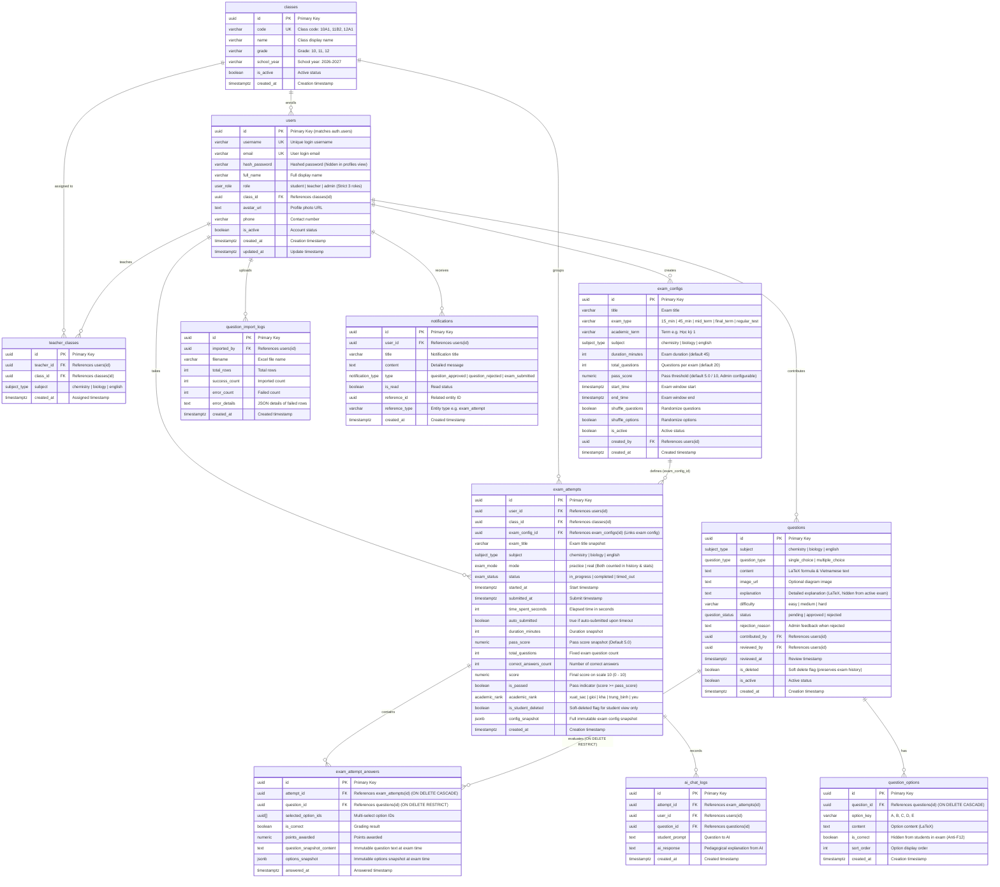

# LƯỢC ĐỒ CƠ SỞ DỮ LIỆU TOÀN DIỆN - EXAM APP (SUPABASE / POSTGRESQL)

> **Tài liệu tham chiếu:** Phân tích từ 10 Flows nghiệp vụ (Hóa, Sinh, Tiếng Anh) & Hướng dẫn chuẩn [Supabase Self-Hosting with Docker](https://supabase.com/docs/guides/self-hosting/docker).  
> **Phiên bản:** 2.2 (Chuẩn hóa toàn diện: Bảng `users`, RLS Matrix, 3 Views, 15 Functions, Xử lý trọn vẹn 3 Cảnh báo Mức độ Cao: Bảo mật riêng tư xem bài thi, Khởi tạo bốc câu hỏi tự động, Chống hack số câu/điểm đạt)  
> **Cập nhật:** 2026-10-05  
> **Mục tiêu:** Cung cấp tài liệu tra cứu hoàn chỉnh về cấu trúc bảng, mối quan hệ, quy tắc nghiệp vụ, bảo mật hàng (RLS) và hướng dẫn tích hợp cho cả nhân sự kỹ thuật (Developers) lẫn quản lý dự án (Product Owners / Stakeholders).

---

## 1. TỔNG QUAN HỆ THỐNG VÀ 4 PHÂN HỆ NGHIỆP VỤ CHÍNH

Cơ sở dữ liệu của **Exam App** được chuẩn hóa bậc 3 (3NF), gồm **11 bảng thực thể vật lý**, **3 views bảo mật & phân tích**, **15 hàm chức năng** (10 hàm nghiệp vụ/trigger/RPC + 5 hàm bảo mật/phân quyền helper) và hệ thống bảo mật hàng (Row Level Security - RLS) đa tầng, chia thành 4 phân hệ chính:

```
┌─────────────────────────────────────────────────────────────────────────────┐
│                             EXAM APP DATABASE                               │
├───────────────────────┬───────────────────────┬─────────────────────────────┤
│ 1. TÀI KHOẢN & LỚP    │ 2. CÂU HỎI THI        │ 3. ĐỀ THI & BÀI LÀM         │
│ - users (bảng chính)  │ - questions (xóa mềm) │ - exam_configs              │
│ - classes             │ - question_options    │ - exam_attempts             │
│ - teacher_classes     │ - question_import_logs│ - exam_attempt_answers      │
├───────────────────────┴───────────────────────┴─────────────────────────────┤
│ 4. THÔNG BÁO, AI CHATBOT & BÁO CÁO TỔNG HỢP (VIEWS & RPC)                   │
│ - notifications (Thông báo duyệt đề thi & bài nộp cho Giáo viên)            │
│ - ai_chat_logs (Lịch sử hỏi đáp AI vì sao đáp án đúng trong thi thử)        │
│ - profiles (View bảo mật kế thừa RLS, ẩn hash_password cho client)          │
│ - view_leaderboard (Bảng xếp hạng THEO HỌC SINH - lấy lượt thi tốt nhất)    │
│ - view_class_performance (Thống kê điểm & tỷ lệ đạt cả Thi Thật & Thi Thử) │
└─────────────────────────────────────────────────────────────────────────────┘
```

> [!IMPORTANT]
> **Quy chuẩn thực thể Người dùng (`users` vs `profiles`):**
> - Bảng dữ liệu vật lý chính thức là `public.users(id, username, email, hash_password, full_name, role, class_id...)` tuân theo đúng quy ước đặt tên tiếng Anh `users(username, hash_password)`.
> - View `public.profiles` là view bảo mật (`security_invoker = true`) bọc trên bảng `users`, loại bỏ hoàn toàn cột nhạy cảm `hash_password` để phục vụ Frontend truy vấn an toàn và duy trì tương thích ngược.

---

## 2. SƠ ĐỒ QUAN HỆ THỰC THỂ (MERMAID ERD)



---

## 3. DANH SÁCH CHI TIẾT 3 VIEWS VÀ 15 FUNCTIONS

### 3.1. Danh mục 3 Views Hệ thống
1. **`public.profiles`**: View bảo mật thay thế cho bảng `users`. Cấu hình `WITH (security_invoker = true)` để kế thừa toàn bộ RLS từ `users`, loại bỏ cột `hash_password`, giúp Frontend truy vấn an toàn mà không lộ mật khẩu đã mã hóa.
2. **`public.view_leaderboard`**: View Bảng xếp hạng thi đua.
   - **Xếp hạng theo từng Học sinh (`user_id`):** Sử dụng `DISTINCT ON (user_id, subject, exam_config_id, mode)` để chọn đúng lượt làm bài xuất sắc nhất của mỗi học sinh (Điểm cao nhất `MAX(score)`, thời gian làm bài nhanh nhất `MIN(time_spent_seconds)`). Mỗi học sinh chỉ xuất hiện đúng 1 dòng trên bảng xếp hạng.
   - **Bảo toàn dữ liệu:** Tính cả bài hoàn thành bình thường (`completed`) lẫn bài hết giờ tự nộp (`timed_out`), không bị ẩn khi học sinh bấm xóa mềm bài thi cá nhân.
3. **`public.view_class_performance`**: View Báo cáo chất lượng giảng dạy theo Lớp và Môn học.
   - **Bao gồm cả Thi Thật (`real`) và Thi Thử (`practice`):** Nhóm theo `(class_id, subject, mode)` giúp Giáo viên và Ban giám hiệu/Admin xem được cả kết quả kiểm tra chính thức lẫn tình hình luyện tập tự do của học sinh.
   - Tính toán đầy đủ: `total_attempts`, `total_students` (số học sinh duy nhất), `average_score`, `highest_score`, `lowest_score`, `passed_count`, `failed_count`, `pass_rate_percent`.

### 3.2. Danh mục 15 Functions (Stored Procedures & Triggers)

| STT | Tên Hàm | Phân Loại | Mục Đích & Cơ Chế Hoạt Động |
| :---: | :--- | :--- | :--- |
| 1 | `handle_updated_at()` | Trigger Helper | Tự động gán `updated_at = now()` khi có cập nhật bản ghi (`users`, `questions`). |
| 2 | `handle_new_user()` | Auth Trigger | Chặn tự nâng quyền khi đăng ký: Cưỡng chế gán `role = 'student'` cho mọi tài khoản mới từ `auth.users`. Quyền `teacher` và `admin` chỉ do Admin cấp nội bộ. |
| 3 | `trg_fn_protect_exam_attempt()` | Security Trigger | **Khóa cứng điểm số & tham số đề thi (Fix Warning 3):** Cưỡng chế `score = 0`, `is_passed = false` khi tạo mới. Ép buộc lấy `total_questions`, `pass_score`, `duration_minutes` từ `exam_configs`. Chặn đứng mọi hành vi client tự gửi lệnh UPDATE sửa `total_questions = 1` hoặc `pass_score = 0.0` để hack điểm 10. |
| 4 | `fn_handle_question_teacher_resubmit()` | Business Trigger | Hỗ trợ giáo viên nộp lại câu hỏi bị từ chối: Khi giáo viên sửa câu hỏi có trạng thái `rejected`, trigger tự động chuyển về `pending` và xóa lý do từ chối để Admin duyệt lại. |
| 5 | `fn_notify_question_review()` | Business Trigger | Tự động tạo bản ghi `notifications` gửi cho giáo viên khi Admin duyệt hoặc từ chối câu hỏi, kèm lý do từ chối. |
| 6 | `fn_get_academic_rank(p_score)` | Business Function | Hàm quy đổi điểm sang xếp loại học lực theo chuẩn Thang 10: Xuất sắc ($\ge 9.0$), Giỏi ($8.0 - 8.9$), Khá ($6.5 - 7.9$), Trung bình ($5.0 - 6.4$), Yếu ($< 5.0$). |
| 7 | `fn_start_exam(p_exam_config_id, p_mode)` | RPC Stored Procedure | **Khởi tạo bài thi & bốc câu hỏi tự động (Fix Warning 2):** Kiểm tra trạng thái kỳ thi, tự động bốc ngẫu nhiên $N$ câu hỏi từ ngân hàng (`status = 'approved'`, `is_active = true`, `is_deleted = false`), tạo lượt thi trong `exam_attempts` và nạp sẵn vào `exam_attempt_answers` kèm snapshot nội dung và đáp án. |
| 8 | `fn_submit_exam_attempt(p_attempt_id, p_auto_submitted)` | RPC Stored Procedure | **Nộp bài & chấm điểm an toàn (Fix Warning 3):** Chạy `SECURITY DEFINER`, chống nộp trùng lặp, đọc `total_questions` chuẩn từ `exam_configs` và số câu thực tế trong bài thi để chia điểm (bỏ trống câu = 0 điểm), so sánh với `pass_score` chuẩn, cập nhật kết quả và tự động gửi thông báo cho giáo viên. |
| 9 | `fn_get_exam_questions(p_attempt_id)` | RPC Security | **Lấy đề thi an toàn (Fix Warning 2 & Chống F12):** Kiểm tra quyền sở hữu lượt thi, tự động nạp câu hỏi dự phòng nếu bảng câu trả lời trống (không bao giờ trả về mảng 0 câu), ẩn hoàn toàn cột `is_correct` và `explanation`. |
| 10 | `fn_get_attempt_review(p_attempt_id)` | RPC Security | **Xem lại bài thi có bảo mật quyền riêng tư (Fix Warning 1):** Kiểm tra nghiêm ngặt `user_id = auth.uid()` hoặc Giáo viên phụ trách lớp/môn hoặc Admin. Chặn đứng tuyệt đối hành vi học sinh xem trộm bài làm, điểm số và đáp án của thí sinh khác. |
| 11 | `get_user_role()` | Security Helper | Trả về `user_role` hiện tại của user đang đăng nhập (`auth.uid()`) từ bảng `users`. |
| 12 | `is_admin()` | Security Helper | Kiểm tra nhanh user hiện tại có quyền `admin` hay không. |
| 13 | `is_teacher()` | Security Helper | Kiểm tra nhanh user hiện tại có quyền `teacher` hay không. |
| 14 | `is_teacher_of_class_and_subject(target_class_id, target_subject)` | Security Helper | Kiểm tra xem giáo viên hiện tại có được phân công giảng dạy đúng lớp và đúng môn học đó trong bảng `teacher_classes` hay không. |
| 15 | `is_teacher_of_subject(target_subject)` | Security Helper | Kiểm tra xem giáo viên hiện tại có được phân công phụ trách môn học đó hay không (dùng khi kiểm tra quyền đóng góp câu hỏi). |

---

## 4. CHI TIẾT CÁC QUY TẮC NGHIỆP VỤ & BẢO MẬT ĐÃ ĐƯỢC ĐỒNG BỘ

### 4.1. Khắc phục Warning 1: Chống xem trộm bài thi của bạn khác trong `fn_get_attempt_review`
- **Lỗ hổng cũ:** Hàm chạy quyền `SECURITY DEFINER` nhưng quên kiểm tra quyền sở hữu, dẫn đến việc bất kỳ học sinh nào chỉ cần biết UUID `attempt_id` của bạn khác là gọi hàm xem được toàn bộ bài làm, điểm số và đáp án.
- **Giải pháp triệt để:** Bổ sung điều kiện kiểm tra phân quyền truy cập nghiêm ngặt:
  ```sql
  IF v_attempt.user_id <> auth.uid() 
     AND NOT public.is_admin() 
     AND NOT (public.is_teacher() AND public.is_teacher_of_class_and_subject(v_attempt.class_id, v_attempt.subject)) THEN
      RAISE EXCEPTION 'Bảo mật: Bạn không có quyền xem lại bài thi của thí sinh khác!';
  END IF;
  ```
  Đồng thời khóa xem đáp án khi bài thi đang ở trạng thái `in_progress` và chế độ thi thật (`real`).

### 4.2. Khắc phục Warning 2: Triệt tiêu lỗi trả về 0 câu hỏi khi bắt đầu làm bài (`fn_get_exam_questions`)
- **Lỗ hổng cũ:** `fn_get_exam_questions` JOIN vào `exam_attempt_answers`. Khi tạo mới lượt thi, bảng này chưa có dữ liệu nên trả về `questions: []`.
- **Giải pháp triệt để:**
  1. Xây dựng RPC chuẩn `fn_start_exam(p_exam_config_id, p_mode)`: Khi thí sinh bắt đầu làm bài, hàm tự động bốc ngẫu nhiên $N$ câu hỏi đã được phê duyệt từ ngân hàng, khởi tạo `exam_attempts`, chèn toàn bộ câu hỏi vào `exam_attempt_answers` kèm snapshot, và trả về đề thi tức thì.
  2. Bổ sung cơ chế tự phục hồi (Self-healing) trong `fn_get_exam_questions`: Nếu phát hiện `exam_attempt_answers` chưa có câu hỏi, hàm tự động bốc và nạp ngay lập tức, đảm bảo không bao giờ xảy ra lỗi 0 câu hỏi.

### 4.3. Khắc phục Warning 3: Chống can thiệp số câu hỏi để hack điểm tuyệt đối
- **Lỗ hổng cũ:** Trigger chỉ chặn sửa `score`, `is_passed`, `correct_answers_count`. Học sinh am hiểu kỹ thuật có thể gửi `UPDATE exam_attempts SET total_questions = 1` hoặc `pass_score = 0.0` qua API PostgREST để khi nộp bài được tính điểm 10/10.
- **Giải pháp triệt để:**
  1. Trigger `trg_fn_protect_exam_attempt` chặn đứng mọi thao tác UPDATE client đối với: `total_questions`, `pass_score`, `duration_minutes`, `status`, `exam_config_id`, `subject`, `user_id`, `mode`, `config_snapshot`. Khi INSERT, trigger cưỡng chế lấy tham số gốc từ `exam_configs`.
  2. Trong `fn_submit_exam_attempt`: Điểm số được chia cho số câu chuẩn lấy lại trực tiếp từ `exam_configs` và đếm thực tế từ `exam_attempt_answers`:
     $$v\_total\_questions = \text{GREATEST}(v\_config\_total, v\_attempt.total\_questions, v\_actual\_questions\_count, 1)$$
     Triệt tiêu hoàn toàn khả năng ép mẫu số về 1 để đạt điểm tối đa bất hợp pháp.

### 4.4. Chống tự nâng quyền khi đăng ký
- **Cơ chế:** Trigger `handle_new_user()` luôn cưỡng chế `role = 'student'` cho mọi tài khoản đăng ký qua Auth.
- **Phân quyền đặc quyền:** Chỉ có Quản trị viên (Admin) mới có quyền đổi `role` của một tài khoản sang `teacher` hoặc `admin` thông qua giao diện quản trị nội bộ.
- **Số lượng vai trò:** Hệ thống áp dụng **chính xác 3 vai trò**: `student`, `teacher`, `admin`. Ban giám hiệu nhà trường theo dõi dashboard và xuất báo cáo toàn trường bằng tài khoản có vai trò `admin`, không phát sinh thêm vai trò riêng.

### 4.5. Chống lộ đáp án qua F12 / Network Inspection
- Bảng `question_options` có RLS chặn triệt để học sinh SELECT trực tiếp các cột đáp án có `is_correct`.
- Trong khi làm bài, học sinh nhận đề thi qua `fn_start_exam` hoặc `fn_get_exam_questions`, dữ liệu trả về chỉ gồm mã đáp án và nội dung, hoàn toàn không có `is_correct` và `explanation`.

### 4.6. Quy chuẩn Thang điểm 10 & Ngưỡng điểm đạt linh hoạt
- **Thang điểm chuẩn:** Thang điểm 10 (từ 0.00 đến 10.00 điểm).
- **Công thức chấm điểm chuẩn xác:**
  $$\text{Điểm} = \text{ROUND}\left( \frac{\text{Số câu đúng}}{\text{Tổng số câu của đề thi}} \times 10, 2 \right)$$
  Các câu thí sinh bỏ trống không có điểm và kéo giảm điểm số chính xác, không xảy ra lỗi 2/2 câu = 10 điểm.
- **Ngưỡng điểm đạt (`pass_score`):**
  - Mặc định là **5.00 điểm / 10**.
  - Admin có toàn quyền điều chỉnh linh hoạt ngưỡng điểm đạt này trong từng cấu hình đề thi (`exam_configs.pass_score`), ví dụ đặt 6.0 hoặc 7.0 điểm tùy tính chất kỳ thi.
  - Hệ thống so sánh: Nếu $\text{score} \ge \text{pass_score} \implies \text{is_passed} = \text{true}$ (Giao diện hiển thị màu **XANH** - Đạt); nếu $\text{score} < \text{pass_score} \implies \text{is_passed} = \text{false}$ (Giao diện hiển thị màu **ĐỎ** - Chưa đạt).

### 4.7. Bài thi thử (`mode = 'practice'`) tính vào Lịch sử & Thống kê
- Cả bài thi thật (`real`) và bài thi thử (`practice`) đều được lưu vào `exam_attempts` và hiển thị đầy đủ trong lịch sử học tập cá nhân của học sinh (Flow 02).
- View `view_class_performance` thống kê kết quả học tập cho cả 2 chế độ (`mode`), giúp giáo viên nắm bắt toàn diện cả mức độ tự luyện tập lẫn kết quả kiểm tra chính thức của học sinh.

### 4.8. Bảng xếp hạng thi đua (`view_leaderboard`) xếp hạng THEO HỌC SINH
- Không tính trùng lặp từng lượt thi: Bảng xếp hạng nhóm theo từng học sinh (`user_id`), môn học (`subject`), đề thi (`exam_config_id`) và chế độ (`mode`).
- Hệ thống tự động chọn lượt thi tốt nhất của mỗi học sinh (Điểm cao nhất $\to$ Thời gian hoàn thành nhanh nhất) để xếp hạng `rank_position`. Mỗi học sinh xuất hiện duy nhất 1 lần trên bảng vinh danh.

### 4.9. Cơ chế Xóa mềm câu hỏi (`questions.is_deleted`) & Bài thi cá nhân (`is_student_deleted`)
- Khi câu hỏi bị xóa khỏi ngân hàng đề thi, hệ thống đánh dấu `questions.is_deleted = true`. Khóa ngoại `exam_attempt_answers.question_id` đặt `ON DELETE RESTRICT` ngăn chặn xóa cứng câu hỏi nếu đã có bài thi tham chiếu. Snapshot nội dung câu hỏi và đáp án bảo toàn trọn vẹn lịch sử thi.
- Khi học sinh bấm xóa bài thi cá nhân, cờ `is_student_deleted = true` chỉ ẩn bài trên màn hình học sinh. Giáo viên phụ trách môn và Admin vẫn xem được toàn bộ điểm số thật để đánh giá và xuất báo cáo.

---

## 5. MA TRẬN PHÂN QUYỀN VÀ ROW LEVEL SECURITY (RLS) ĐẦY ĐỦ 11 BẢNG

| STT | Bảng Dữ Liệu | Thí sinh (Student) | Giáo viên bộ môn (Teacher) | Quản trị viên (Admin) |
| :---: | :--- | :--- | :--- | :--- |
| 1 | `classes` | **SELECT**: Chỉ xem các lớp đang hoạt động (`is_active = true`) để chọn khi đăng ký. | **SELECT**: Xem danh sách lớp học đang hoạt động. | **ALL (CRUD)**: Toàn quyền tạo mới, chỉnh sửa, xóa và phân lớp học sinh. |
| 2 | `users` | **SELECT / UPDATE**: Chỉ xem và cập nhật hồ sơ cá nhân của mình (`id = auth.uid()`). Không thể tự đổi `role`. | **SELECT**: Xem hồ sơ của chính mình và học sinh thuộc các lớp mình phụ trách giảng dạy. | **ALL (CRUD)**: Toàn quyền tra cứu hồ sơ và thay đổi phân quyền mọi tài khoản. |
| 3 | `teacher_classes` | **Không có quyền truy cập**. | **SELECT**: Xem phân công giảng dạy môn học và lớp phụ trách của chính mình. | **ALL (CRUD)**: Toàn quyền phân công giáo viên vào từng lớp theo từng môn học. |
| 4 | `exam_configs` | **SELECT**: Chỉ xem các cấu hình đề thi đang mở hoạt động (`is_active = true`). | **SELECT**: Xem cấu hình các đề thi đang mở hoặc liên quan môn mình dạy. | **ALL (CRUD)**: Toàn quyền thiết lập đề thi, thời gian, số câu, điểm đạt, kỳ thi. |
| 5 | `questions` | **SELECT**: Chỉ xem câu hỏi đã được phê duyệt (`approved`), đang hoạt động và chưa bị xóa mềm trong bài thi. | **SELECT / INSERT / UPDATE**: Xem câu đã duyệt + câu mình đóng góp. Đề xuất câu mới thuộc môn mình dạy (`pending`). Sửa câu bị từ chối (`rejected`) để nộp lại. | **ALL (CRUD)**: Toàn quyền duyệt, từ chối kèm lý do, sửa đổi và xóa mềm câu hỏi (`is_deleted = true`). |
| 6 | `question_options` | **Không SELECT trực tiếp (Chống F12)**. Nhận dữ liệu câu hỏi qua RPC `fn_start_exam` / `fn_get_exam_questions` (ẩn `is_correct`). | **SELECT / ALL**: Xem và quản lý đáp án các câu hỏi thuộc môn mình phụ trách hoặc do mình đóng góp. | **ALL (CRUD)**: Toàn quyền quản trị danh sách phương án lựa chọn và đáp án đúng. |
| 7 | `exam_attempts` | **SELECT / INSERT / UPDATE**: Chỉ xem bài của mình (`is_student_deleted = false`). Điểm số và tham số đề thi bị khóa chặt bởi trigger. Nộp bài qua RPC. | **SELECT**: Xem toàn bộ kết quả thi của học sinh lớp mình dạy theo đúng môn phụ trách (kể cả bài học sinh đã xóa mềm cá nhân). | **ALL (CRUD)**: Toàn quyền xem và quản lý kết quả thi của toàn bộ học sinh trên hệ thống. |
| 8 | `exam_attempt_answers` | **SELECT / INSERT / UPDATE**: Xem câu trả lời của bài mình sau khi nộp hoặc ở chế độ thi thử. Ghi nhận lựa chọn khi bài thi `in_progress`. | **SELECT**: Xem bài làm chi tiết từng câu của học sinh lớp mình phụ trách theo đúng môn. | **ALL (CRUD)**: Toàn quyền tra cứu chi tiết bài làm của mọi thí sinh phục vụ hậu kiểm. |
| 9 | `notifications` | **ALL**: Xem và đánh dấu đã đọc các thông báo của chính mình (`user_id = auth.uid()`). | **ALL**: Nhận thông báo tự động khi Admin duyệt/từ chối câu hỏi hoặc khi học sinh nộp bài thi mới. | **ALL (CRUD)**: Toàn quyền quản trị và gửi thông báo hệ thống. |
| 10 | `ai_chat_logs` | **SELECT / INSERT**: Hỏi đáp trợ lý AI và xem lịch sử hỏi đáp bài thi của chính mình. | **SELECT**: Xem lịch sử học sinh hỏi đáp AI trong các bài thi thử thuộc lớp mình phụ trách. | **ALL (CRUD)**: Toàn quyền quản trị nhật ký AI Chatbot. |
| 11 | `question_import_logs` | **Không có quyền truy cập**. | **SELECT / INSERT**: Xem lịch sử và kết quả các lượt import file câu hỏi Excel do chính mình tải lên. | **ALL (CRUD)**: Toàn quyền theo dõi và quản lý mọi phiên import câu hỏi trên toàn hệ thống. |

---

## 6. HƯỚNG DẪN TÍCH HỢP CLIENT (NEXT.JS FRONTEND)

### 6.1. Bắt đầu bài thi và Tự động bốc câu hỏi (Khắc phục Warning 2 & Chống F12)
```typescript
// 1. Học sinh bắt đầu làm bài thi: Gọi RPC fn_start_exam
const { data: examData, error } = await supabase.rpc('fn_start_exam', {
  p_exam_config_id: examConfigId,
  p_mode: 'real' // hoặc 'practice'
});

// examData trả về:
// {
//   attempt_id: "a0000000-...",
//   exam_title: "Đề kiểm tra 45 phút Hóa học",
//   duration_minutes: 45,
//   total_questions: 20,
//   questions: [
//     {
//       id: "q-1",
//       content: "Cho phản ứng Fe + 2HCl...",
//       question_type: "single_choice",
//       options: [
//         { id: "opt-1", option_key: "A", content: "Chất khử" },
//         { id: "opt-2", option_key: "B", content: "Chất oxi hóa" }
//       ]
//     }
//   ]
// }
```

### 6.2. Nộp bài và Nhận kết quả chấm điểm an toàn (Khắc phục Warning 3)
```typescript
// 2. Học sinh nộp bài: Gọi RPC fn_submit_exam_attempt
const { data: result, error } = await supabase.rpc('fn_submit_exam_attempt', {
  p_attempt_id: examData.attempt_id,
  p_auto_submitted: false
});

// result trả về kết quả chính xác từ máy chủ:
// {
//   score: 8.50,
//   pass_score: 5.00,
//   is_passed: true,
//   correct_count: 17,
//   total_questions: 20,
//   academic_rank: "gioi"
// }
```

### 6.3. Xem lại bài thi sau khi nộp (Khắc phục Warning 1 - Bảo mật riêng tư)
```typescript
// 3. Học sinh xem lại bài thi: Gọi RPC fn_get_attempt_review
// Hàm tự động từ chối nếu không phải chính chủ thí sinh hoặc giáo viên/admin phụ trách
const { data: reviewData, error } = await supabase.rpc('fn_get_attempt_review', {
  p_attempt_id: examData.attempt_id
});
```

### 6.4. Tra cứu Bảng xếp hạng theo Học sinh
```typescript
// 4. Tra cứu Top 10 học sinh dẫn đầu môn Hóa học
const { data: leaderboard, error } = await supabase
  .from('view_leaderboard')
  .select('*')
  .eq('subject', 'chemistry')
  .eq('mode', 'real')
  .order('rank_position', { ascending: true })
  .limit(10);
```
