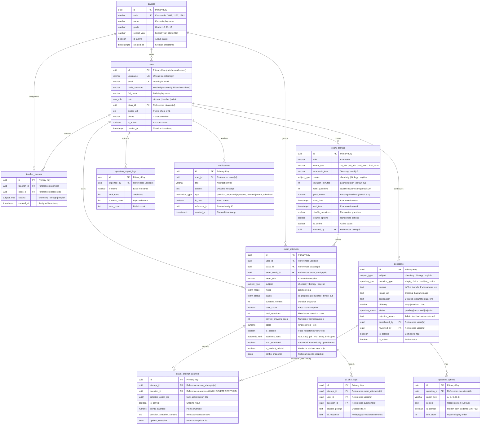

# LƯỢC ĐỒ CƠ SỞ DỮ LIỆU TOÀN DIỆN - EXAM APP (SUPABASE / POSTGRESQL)

> **Tài liệu tham chiếu:** Phân tích từ 10 Flows nghiệp vụ (Hóa, Sinh, Tiếng Anh) & Hướng dẫn chuẩn [Supabase Self-Hosting with Docker](https://supabase.com/docs/guides/self-hosting/docker).  
> **Phiên bản:** 2.0 (Cập nhật vá toàn diện 8 lỗ hổng bảo mật & hoàn thiện tính năng nâng cao)  
> **Cập nhật:** 2026-10-05  
> **Mục tiêu:** Cung cấp tài liệu tra cứu hoàn chỉnh về cấu trúc bảng, mối quan hệ, quy tắc nghiệp vụ, bảo mật hàng (RLS) và hướng dẫn tích hợp cho cả nhân sự kỹ thuật (Developers) lẫn quản lý dự án (Product Owners / Stakeholders).

---

## 1. TỔNG QUAN HỆ THỐNG VÀ 4 PHÂN HỆ NGHIỆP VỤ CHÍNH

Cơ sở dữ liệu của **Exam App** được chuẩn hóa bậc 3 (3NF), gồm **11 bảng thực thể**, **2 view phân tích bảo mật**, **7 hàm xử lý nghiệp vụ tự động** và hệ thống bảo mật hàng (RLS) đa tầng, chia thành 4 phân hệ chính:

```
┌─────────────────────────────────────────────────────────────────────────────┐
│                             EXAM APP DATABASE                               │
├───────────────────────┬───────────────────────┬─────────────────────────────┤
│ 1. TÀI KHOẢN & LỚP    │ 2. CÂU HỎI THI        │ 3. ĐỀ THI & BÀI LÀM         │
│ - users               │ - questions           │ - exam_configs              │
│ - classes             │ - question_options    │ - exam_attempts             │
│ - teacher_classes     │ - question_import_logs│ - exam_attempt_answers      │
├───────────────────────┴───────────────────────┴─────────────────────────────┤
│ 4. THÔNG BÁO, AI CHATBOT & BÁO CÁO TỔNG HỢP                                 │
│ - notifications (Thông báo duyệt đề thi & bài nộp cho Giáo viên)            │
│ - ai_chat_logs (Lịch sử hỏi đáp AI vì sao đáp án đúng trong thi thử)        │
│ - view_leaderboard (Bảng xếp hạng tính cả bài hoàn thành & hết giờ tự nộp)  │
│ - view_class_performance (Thống kê điểm & tỷ lệ đạt theo Lớp & Môn học)    │
└─────────────────────────────────────────────────────────────────────────────┘
```

---

## 2. SƠ ĐỒ QUAN HỆ THỰC THỂ (MERMAID ERD)



---

## 3. CHI TIẾT 8 VẤN ĐỀ BẢO MẬT ĐÃ ĐƯỢC KHẮC PHỤC TRIỆT ĐỂ

### 3.1. Chống tự nâng quyền khi đăng ký (Privilege Escalation Prevention)
- **Vấn đề cũ:** Trigger đọc `NEW.raw_user_meta_data->>'role'`, người dùng có thể gửi `{ role: 'admin' }` qua API `signUp` để tự biến mình thành Admin.
- **Giải pháp triệt để:** Trigger `handle_new_user()` **mặc định cưỡng chế role = 'student'** cho mọi tài khoản đăng ký qua Auth. Chỉ có Admin hiện tại mới có quyền cấp quyền `teacher` hoặc `admin` thông qua quản trị nội bộ.

### 3.2. Chống lộ đáp án qua F12 / API (Anti-Cheat / Inspection Protection)
- **Vấn đề cũ:** Học sinh gọi `SELECT * FROM question_options` là xem được toàn bộ cột `is_correct = true/false` và `questions.explanation` ngay trong khi đang làm bài.
- **Giải pháp triệt để:**
  - Chính sách RLS trên bảng `question_options` chỉ cho phép Giáo viên và Admin SELECT trực tiếp.
  - Học sinh lấy đề thi qua hàm RPC bảo mật `fn_get_exam_questions(attempt_id)`. Hàm này trả về đề thi và các lựa chọn nhưng **bỏ hoàn toàn cột `is_correct` và `explanation`**.
  - Sau khi nộp bài (`completed` hoặc `timed_out`), học sinh mới được gọi `fn_get_attempt_review(attempt_id)` để xem đáp án đúng và lời giải thích.

### 3.3. Chống tự sửa điểm & tự chèn bài thi điểm 10 (Grade Tampering Prevention)
- **Vấn đề cũ:** Học sinh có thể gửi lệnh `update({ score: 10, is_passed: true })` trực tiếp xuống bảng `exam_attempts`.
- **Giải pháp triệt để:**
  - Bổ sung Trigger `trg_protect_exam_attempt_grades`:
    - Khi `INSERT`: Cưỡng chế `score = 0.00`, `is_passed = false`, `status = 'in_progress'`.
    - Khi `UPDATE`: Chặn mọi thao tác sửa đổi điểm số, số câu đúng và trạng thái bài thi từ API client.
    - Điểm số chỉ được cập nhật duy nhất qua Stored Procedure `fn_submit_exam_attempt()` (chạy với quyền `SECURITY DEFINER` và cờ phiên bảo mật `exam.is_submitting = 'true'`).

### 3.4. Chống lộ hash_password & email qua View profiles
- **Vấn đề cũ:** View `public.profiles` chạy dưới quyền owner (bỏ qua RLS) và `SELECT * FROM users` để lộ cả cột `hash_password`.
- **Giải pháp triệt để:**
  - View `public.profiles` được cấu hình `WITH (security_invoker = true)` để kế thừa 100% chính sách RLS từ bảng `users`.
  - Cột `hash_password` bị **loại trừ hoàn toàn khỏi view `profiles`**.

### 3.5. Bảo toàn bài tự nộp do hết giờ (timed_out) trong Báo cáo & Xếp hạng
- **Vấn đề cũ:** View `view_leaderboard` và `view_class_performance` chỉ lọc `status = 'completed'`, khiến các bài làm bị hết giờ (`timed_out`) biến mất khỏi bảng điểm.
- **Giải pháp triệt để:** Cập nhật điều kiện lọc: `WHERE ea.status IN ('completed', 'timed_out') AND ea.mode = 'real'`. Bài thi tự động nộp bài được ghi nhận đầy đủ điểm số và xếp hạng.

### 3.6. Bảo toàn dữ liệu báo cáo khi học sinh xóa mềm
- **Vấn đề cũ:** Học sinh bấm "Xóa bài thi" khiến bài thi bị ẩn ở cả bảng điểm của Giáo viên và Admin, làm sai lệch điểm trung bình và thống kê lớp.
- **Giải pháp triệt để:**
  - Sử dụng cột `is_student_deleted`: Khi học sinh xóa, cờ này đổi thành `true` để ẩn trên giao diện cá nhân của học sinh.
  - Chính sách RLS của Giáo viên phụ trách lớp và Admin **không lọc cờ `is_student_deleted`**, bảo đảm giáo viên luôn nhìn thấy toàn bộ kết quả thi thật để đánh giá và xuất báo cáo.

### 3.7. Bảo toàn lịch sử bài thi khi xóa câu hỏi
- **Vấn đề cũ:** Khóa ngoại `exam_attempt_answers.question_id` để `ON DELETE CASCADE`. Khi Admin xóa câu hỏi, toàn bộ câu trả lời trong các bài thi cũ bị xóa theo!
- **Giải pháp triệt để:**
  - Đổi ràng buộc khóa ngoại sang `ON DELETE RESTRICT`. Không cho phép xóa cứng câu hỏi nếu đã có bài thi tham chiếu.
  - Bổ sung cờ xóa mềm `questions.is_deleted = true`.
  - Lưu snapshot nội dung câu hỏi `question_snapshot_content` và đáp án `options_snapshot` trong bảng `exam_attempt_answers`.

### 3.8. Chấm điểm chuẩn xác theo tổng số câu đề thi
- **Vấn đề cũ:** Hàm chấm điểm chia cho `SELECT COUNT(*) FROM exam_attempt_answers`. Nếu thí sinh chỉ làm 2 câu và bỏ trống 18 câu, hệ thống tính 2/2 = 10 điểm!
- **Giải pháp triệt để:**
  - Lấy `v_total_questions` cố định từ `exam_attempts.total_questions` (hoặc cấu hình đề thi).
  - Điểm được tính chuẩn:
    $$\text{Điểm} = \text{ROUND}\left( \frac{\text{Số câu đúng}}{\text{Tổng số câu đề thi}} \times 10, 2 \right)$$
  - Các câu bỏ trống không có điểm và kéo giảm điểm số chính xác theo quy chế thi.

---

## 4. CÁC TÍNH NĂNG MỞ RỘNG BỔ SUNG

1. **Giới hạn quyền Giáo viên theo môn học:**
   - Bảng `teacher_classes(teacher_id, class_id, subject)` xác định chính xác môn và lớp phụ trách.
   - Hàm `is_teacher_of_class_and_subject()` bảo đảm giáo viên dạy Hóa chỉ xem và chấm điểm môn Hóa của lớp mình phụ trách.
   - Giáo viên chỉ có thể đóng góp câu hỏi cho môn học mình được phân công giảng dạy.
2. **Bảng thông báo hệ thống (`notifications`):**
   - Tự động gửi thông báo cho giáo viên khi Admin duyệt hoặc từ chối câu hỏi kèm lý do.
   - Tự động thông báo cho giáo viên khi học sinh trong lớp hoàn thành bài thi thật.
3. **Cột phân loại câu hỏi (`question_type`):**
   - Phân biệt rõ `single_choice` (1 đáp án đúng - radio button) và `multiple_choice` (nhiều đáp án đúng - checkbox).
4. **Snapshot cấu hình đề thi tại thời điểm thi:**
   - Lưu trữ `exam_title`, `duration_minutes`, `pass_score`, `total_questions` và `config_snapshot (JSONB)` trực tiếp trên từng `exam_attempts`. Tránh việc cấu hình đề thi bị sửa đổi trong tương lai làm sai lệch lịch sử bài thi cũ.
5. **Giáo viên chỉnh sửa và nộp lại câu hỏi bị từ chối:**
   - Khi Admin từ chối câu hỏi (`status = 'rejected'`), giáo viên đọc lý do `rejection_reason`, chỉnh sửa lại nội dung.
   - Trigger `trg_question_teacher_resubmit` tự động đưa trạng thái về `pending` và xóa lý do từ chối để Admin duyệt lại.

---

## 5. MA TRẬN PHÂN QUYỀN VÀ ROW LEVEL SECURITY (RLS)

| Bảng | Thí sinh (Student) | Giáo viên bộ môn (Teacher) | Quản trị viên (Admin) |
| :--- | :--- | :--- | :--- |
| `classes` | Chỉ xem danh sách lớp đang hoạt động để chọn khi đăng ký. | Xem danh sách lớp. | Toàn quyền CRUD (Tạo, sửa, xóa, phân lớp). |
| `users` | Xem và sửa thông tin cá nhân của mình (không đổi role). | Xem hồ sơ học sinh thuộc lớp mình dạy. | Toàn quyền xem và cập nhật phân quyền mọi user. |
| `teacher_classes` | Không có quyền truy cập. | Xem phân công giảng dạy của mình. | Toàn quyền phân công giáo viên vào lớp theo môn. |
| `exam_configs` | Xem các đề thi đang mở. | Xem cấu hình đề thi. | Toàn quyền cấu hình (số câu, thời gian, điểm đạt, loại kỳ thi). |
| `questions` | Xem các câu hỏi đã duyệt (`approved`) thông qua bài thi. | Xem câu hỏi đã duyệt + các câu do mình đóng góp (`pending`, `rejected`). Sửa câu bị rejected để nộp lại. | Toàn quyền CRUD, duyệt / từ chối câu hỏi, xóa mềm câu hỏi. |
| `question_options` | **Không SELECT trực tiếp (tránh F12)**; chỉ nhận dữ liệu qua RPC `fn_get_exam_questions` (ẩn `is_correct`). | Xem toàn bộ đáp án (kể cả `is_correct`) của môn mình phụ trách. | Toàn quyền quản trị đáp án. |
| `exam_attempts` | **Chỉ xem bài của mình (`user_id = auth.uid()`, `is_student_deleted = false`)**. Điểm số bị khóa, không thể tự sửa. | Xem toàn bộ kết quả của học sinh lớp mình dạy theo đúng môn (kể cả bài học sinh đã xóa cá nhân). | Toàn quyền xem toàn bộ hệ thống để xuất báo cáo. |
| `exam_attempt_answers` | Xem câu trả lời của bài mình sau khi nộp hoặc ở chế độ thi thử. | Xem bài làm chi tiết của học sinh lớp mình theo đúng môn. | Toàn quyền xem để phục vụ hậu kiểm. |
| `notifications` | Nhận thông báo cá nhân. | Nhận thông báo duyệt câu hỏi, bài thi mới nộp. | Toàn quyền quản trị thông báo. |
| `ai_chat_logs` | Xem và tạo nhật ký hỏi đáp AI của bài thi mình. | Xem nhật ký AI của học sinh lớp mình. | Toàn quyền quản trị. |
