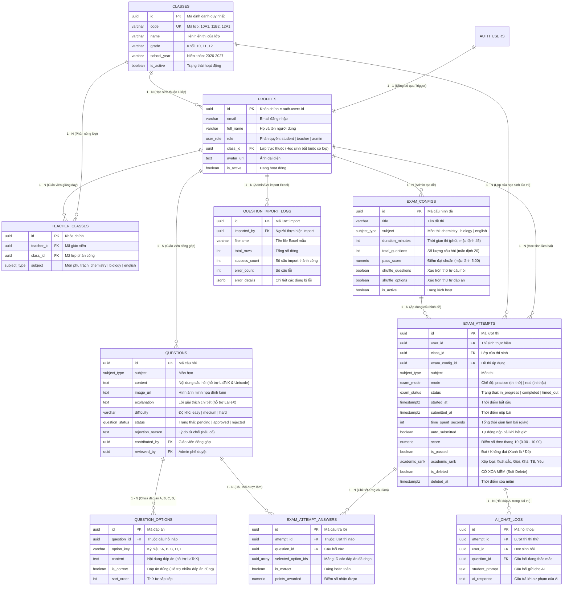

# LƯỢC ĐỒ CƠ SỞ DỮ LIỆU TOÀN DIỆN - EXAM APP (SUPABASE / POSTGRESQL)

> **Tài liệu tham chiếu:** Phân tích từ 10 Flows nghiệp vụ (Hóa, Sinh, Tiếng Anh) & Hướng dẫn chuẩn [Supabase Self-Hosting with Docker](https://supabase.com/docs/guides/self-hosting/docker).  
> **Phiên bản:** 1.0  
> **Cập nhật:** 2026-09-30  
> **Mục tiêu:** Cung cấp tài liệu tra cứu hoàn chỉnh về cấu trúc bảng, mối quan hệ, quy tắc nghiệp vụ, bảo mật hàng (RLS) và hướng dẫn tích hợp cho cả nhân sự kỹ thuật (Developers) lẫn quản lý dự án (Product Owners / Stakeholders).

---

## 1. TỔNG QUAN HỆ THỐNG VÀ 4 PHÂN HỆ NGHIỆP VỤ CHÍNH

Cơ sở dữ liệu của **Exam App** được chuẩn hóa bậc 3 (3NF), gồm **10 bảng thực thể**, **2 view phân tích**, **5 hàm xử lý nghiệp vụ tự động** và hệ thống bảo mật hàng (RLS) đa tầng, chia thành 4 phân hệ chính:

```
┌─────────────────────────────────────────────────────────────────────────────┐
│                             EXAM APP DATABASE                               │
├───────────────────────┬───────────────────────┬─────────────────────────────┤
│ 1. TÀI KHOẢN & LỚP    │ 2. CÂU HỎI THI        │ 3. ĐỀ THI & BÀI LÀM         │
│ - profiles            │ - questions           │ - exam_configs              │
│ - classes             │ - question_options    │ - exam_attempts (Xóa mềm)   │
│ - teacher_classes     │ - question_import_logs│ - exam_attempt_answers      │
├───────────────────────┴───────────────────────┴─────────────────────────────┤
│ 4. TRỢ LÝ AI CHATBOT & BÁO CÁO TỔNG HỢP                                     │
│ - ai_chat_logs (Lịch sử hỏi đáp AI vì sao đáp án đúng trong thi thử)        │
│ - view_leaderboard (Bảng xếp hạng Top 10/20/50 điểm cao nhất)               │
│ - view_class_performance (Thống kê điểm & tỷ lệ đạt theo Lớp để đánh giá GV)│
└─────────────────────────────────────────────────────────────────────────────┘
```

---

## 2. SƠ ĐỒ QUAN HỆ THỰC THỂ (MERMAID ERD)



---

## 3. TỪ ĐIỂN DỮ LIỆU CHI TIẾT (DATA DICTIONARY)

### 3.1. Các kiểu dữ liệu ENUM (Đặc thù nghiệp vụ)
1. **`user_role`**:
   - `'student'`: Thí sinh / Học sinh (chỉ thi, xem kết quả của mình, xóa mềm bài của mình).
   - `'teacher'`: Giáo viên bộ môn (xem học sinh các lớp phụ trách, xuất bảng điểm Excel/PDF, đóng góp câu hỏi).
   - `'admin'`: Quản trị viên hệ thống (toàn quyền cấu hình, phê duyệt câu hỏi, phân lớp, xem toàn bộ báo cáo).
2. **`subject_type`**:
   - `'chemistry'`: Môn Hóa học (hỗ trợ công thức phản ứng $\ce{...}$).
   - `'biology'`: Môn Sinh học (hỗ trợ di truyền, quang hợp, ADN/ARN).
   - `'english'`: Môn Tiếng Anh (ngữ pháp, từ đồng nghĩa, đọc hiểu).
3. **`exam_mode`**:
   - `'practice'`: Thi thử (hiện đáp án đúng sáng lên, đáp án sai có icon đỏ, kèm lời giải thích và Chatbot AI giải đáp).
   - `'real'`: Thi thật (đồng hồ đếm lùi, hết giờ tự nộp bài, tính điểm thang 10 và xếp loại sau khi nộp).
4. **`exam_status`**:
   - `'in_progress'`: Đang làm bài thi.
   - `'completed'`: Đã nộp bài thủ công bởi thí sinh.
   - `'timed_out'`: Tự động nộp bài do hết thời gian làm bài quy định.
   - `'cancelled'`: Đã hủy bỏ.
5. **`question_status`**:
   - `'pending'`: Câu hỏi mới do Giáo viên đóng góp, đang chờ Admin duyệt.
   - `'approved'`: Đã được Admin phê duyệt đưa vào ngân hàng đề thi chính thức.
   - `'rejected'`: Bị Admin từ chối kèm lý do phản hồi.
6. **`academic_rank`**:
   - `'xuat_sac'`: Xuất sắc (Điểm $\ge 9.0$).
   - `'gioi'`: Giỏi ($8.0 \le \text{Điểm} < 9.0$).
   - `'kha'`: Khá ($6.5 \le \text{Điểm} < 8.0$).
   - `'trung_binh'`: Trung bình ($5.0 \le \text{Điểm} < 6.5$).
   - `'yeu'`: Yếu (Điểm $< 5.0$).

---

### 3.2. Bảng `classes` (Quản lý Lớp học)
- **Mục đích:** Lưu trữ danh mục lớp học, phục vụ việc phân lớp học sinh và phân công giáo viên giảng dạy.
- **Ràng buộc:** `code` là duy nhất trên toàn hệ thống (VD: `10A1`, `11B2`, `12A1`).

| Tên Cột | Kiểu Dữ Liệu | Ràng Buộc | Ý Nghĩa Nghiệp Vụ |
| :--- | :--- | :--- | :--- |
| `id` | `UUID` | PK, `gen_random_uuid()` | Mã định danh duy nhất của lớp học |
| `code` | `VARCHAR(50)` | UNIQUE, NOT NULL | Mã lớp hiển thị ngắn gọn (`10A1`, `11B2`...) |
| `name` | `VARCHAR(100)` | NOT NULL | Tên đầy đủ (VD: `Lớp 10A1 Chuyên Tự Nhiên`) |
| `grade` | `VARCHAR(20)` | NOT NULL | Khối lớp: `'10'`, `'11'`, `'12'`, `'other'` |
| `school_year` | `VARCHAR(20)` | DEFAULT `'2026-2027'` | Niên khóa giảng dạy |
| `is_active` | `BOOLEAN` | DEFAULT `true` | Đang mở nhận học sinh hay đã đóng |
| `created_at` | `TIMESTAMPTZ` | DEFAULT `now()` | Thời điểm tạo |
| `updated_at` | `TIMESTAMPTZ` | DEFAULT `now()` | Thời điểm cập nhật cuối cùng |

---

### 3.3. Bảng `profiles` (Hồ sơ người dùng)
- **Mục đích:** Lưu trữ thông tin chi tiết người dùng, liên kết 1-1 với tài khoản bảo mật của Supabase Auth (`auth.users`).
- **Cơ chế tự động:** Được kích hoạt ngay khi người dùng đăng ký qua Form hoặc Login Google thông qua Trigger PostgreSQL `on_auth_user_created`.

| Tên Cột | Kiểu Dữ Liệu | Ràng Buộc | Ý Nghĩa Nghiệp Vụ |
| :--- | :--- | :--- | :--- |
| `id` | `UUID` | PK, FK `auth.users(id)` ON DELETE CASCADE | Khóa ngoại khớp chính xác với ID tài khoản Auth |
| `email` | `VARCHAR(255)` | NOT NULL | Email đăng nhập của người dùng |
| `full_name` | `VARCHAR(255)` | NOT NULL | Họ và tên hiển thị |
| `role` | `user_role` | NOT NULL, DEFAULT `'student'` | Quyền hạn: Thí sinh (`student`), Giáo viên (`teacher`), Quản trị (`admin`) |
| `class_id` | `UUID` | FK `classes(id)` ON DELETE SET NULL | Lớp học trực thuộc (Học sinh bắt buộc chọn lớp khi đăng ký) |
| `avatar_url` | `TEXT` | NULLABLE | Đường dẫn ảnh đại diện (hoặc avatar Google OAuth) |
| `phone` | `VARCHAR(50)` | NULLABLE | Số điện thoại liên hệ |
| `is_active` | `BOOLEAN` | DEFAULT `true` | Trạng thái tài khoản |
| `created_at` | `TIMESTAMPTZ` | DEFAULT `now()` | Ngày tạo tài khoản |
| `updated_at` | `TIMESTAMPTZ` | DEFAULT `now()` | Ngày cập nhật gần nhất |

---

### 3.4. Bảng `teacher_classes` (Phân công Giáo viên phụ trách lớp)
- **Mục đích:** Quản lý xem giáo viên nào được quyền phụ trách môn nào tại lớp nào.
- **Ràng buộc:** Cặp `(teacher_id, class_id, subject)` là duy nhất.

| Tên Cột | Kiểu Dữ Liệu | Ràng Buộc | Ý Nghĩa Nghiệp Vụ |
| :--- | :--- | :--- | :--- |
| `id` | `UUID` | PK, `gen_random_uuid()` | Khóa chính của phân công |
| `teacher_id` | `UUID` | FK `profiles(id)` ON DELETE CASCADE | Giáo viên được phân công (role = `'teacher'`) |
| `class_id` | `UUID` | FK `classes(id)` ON DELETE CASCADE | Lớp học được phân công |
| `subject` | `subject_type` | NOT NULL | Môn học phụ trách (`chemistry`, `biology`, `english`) |
| `created_at` | `TIMESTAMPTZ` | DEFAULT `now()` | Ngày phân công |

---

### 3.5. Bảng `exam_configs` (Cấu hình Đề thi)
- **Mục đích:** Cho phép Admin tùy chỉnh linh hoạt các thông số bài thi cho từng môn học.

| Tên Cột | Kiểu Dữ Liệu | Ràng Buộc | Ý Nghĩa Nghiệp Vụ |
| :--- | :--- | :--- | :--- |
| `id` | `UUID` | PK, `gen_random_uuid()` | Khóa chính cấu hình đề |
| `title` | `VARCHAR(255)` | NOT NULL | Tên đề thi (VD: `Đề thi trắc nghiệm Hóa 10 HK1`) |
| `subject` | `subject_type` | NOT NULL | Môn thi (`chemistry`, `biology`, `english`) |
| `duration_minutes` | `INT` | DEFAULT `45`, CHECK `> 0` | Thời gian làm bài tính bằng phút |
| `total_questions` | `INT` | DEFAULT `20`, CHECK `> 0` | Số lượng câu hỏi ngẫu nhiên trong mỗi lần thi |
| `pass_score` | `NUMERIC(4,2)` | DEFAULT `5.00`, CHECK `0-10` | Ngưỡng điểm đạt (đạt giao diện Xanh, trượt giao diện Đỏ) |
| `shuffle_questions` | `BOOLEAN` | DEFAULT `true` | Đảo ngẫu nhiên câu hỏi mỗi lần thí sinh bấm "Thi" |
| `shuffle_options` | `BOOLEAN` | DEFAULT `true` | Đảo ngẫu nhiên vị trí các đáp án A, B, C, D |
| `is_active` | `BOOLEAN` | DEFAULT `true` | Kích hoạt cho phép thí sinh vào thi |
| `created_by` | `UUID` | FK `profiles(id)` | Admin thiết lập |
| `created_at`, `updated_at` | `TIMESTAMPTZ` | DEFAULT `now()` | Thời gian tạo và cập nhật |

---

### 3.6. Bảng `questions` & `question_options` (Ngân hàng Câu hỏi & Đáp án)
- **Hỗ trợ công thức Toán, Lý, Hóa (LaTeX):** Nội dung câu hỏi và giải thích lưu chuỗi LaTeX chuẩn như `\ce{Fe + 2HCl -> FeCl2 + H2 ^}`, `$\frac{-b \pm \sqrt{\Delta}}{2a}$`.
- **Hỗ trợ nhiều đáp án đúng (Checkbox):** Bảng `question_options` cho phép câu hỏi có 1 hoặc nhiều lựa chọn có `is_correct = true`. Thí sinh chỉ được tính điểm khi chọn đúng và đủ tất cả các đáp án đúng của câu hỏi đó.
- **Quy trình duyệt câu hỏi:** Giáo viên đóng góp câu hỏi có `status = 'pending'`. Admin xem xét phê duyệt (`approved`) hoặc từ chối (`rejected`) kèm lý do `rejection_reason`.

| Tên Cột | Bảng | Kiểu | Mô Tả |
| :--- | :--- | :--- | :--- |
| `content` | `questions` | `TEXT` | Đề bài câu hỏi (hỗ trợ tiếng Việt và LaTeX) |
| `explanation` | `questions` | `TEXT` | Lời giải thích vì sao đáp án đúng (hỗ trợ LaTeX) |
| `difficulty` | `questions` | `VARCHAR(20)` | Độ khó: `'easy'`, `'medium'`, `'hard'` |
| `status` | `questions` | `question_status` | Trạng thái: `'pending'`, `'approved'`, `'rejected'` |
| `contributed_by` | `questions` | `UUID` | Giáo viên gửi đề xuất câu hỏi |
| `reviewed_by` | `questions` | `UUID` | Quản trị viên duyệt câu hỏi |
| `option_key` | `question_options` | `VARCHAR(5)` | Ký hiệu đáp án: `'A'`, `'B'`, `'C'`, `'D'`, `'E'` |
| `is_correct` | `question_options` | `BOOLEAN` | Đánh dấu là đáp án đúng (`true`/`false`) |

---

### 3.7. Bảng `exam_attempts` & `exam_attempt_answers` (Lượt thi & Xóa mềm)
- **Cơ chế Xóa mềm (Soft Delete):** Cột `is_deleted = true` và `deleted_at = now()`.
  - Học sinh **chỉ xem lại và chỉ xóa mềm được bài thi của chính mình**.
  - Tuyệt đối không xem và không xóa được bài thi của học sinh khác.
  - Bài thi không bị xóa cứng khỏi ổ đĩa để đảm bảo Admin có thể kiểm toán, lập bảng tổng kết hoặc phục hồi khi cần.
- **Chấm điểm thang 10 & Xếp loại tự động:**
  - Điểm được tự động tính ngay khi nộp bài:
    $$\text{score} = \text{ROUND}\left( \frac{\text{Số câu đúng}}{\text{Tổng số câu}} \times 10, 2 \right)$$
  - Chỉ báo trực quan: `is_passed = (score >= pass_score)` (Điểm đạt $\rightarrow$ Giao diện Xanh; Điểm không đạt $\rightarrow$ Giao diện Đỏ).
  - Tự động nộp bài khi hết giờ: `auto_submitted = true` và `status = 'timed_out'`.

| Tên Cột | Kiểu Dữ Liệu | Ràng Buộc | Ý Nghĩa Nghiệp Vụ |
| :--- | :--- | :--- | :--- |
| `id` | `UUID` | PK, `gen_random_uuid()` | Mã duy nhất của bài thi |
| `user_id` | `UUID` | FK `profiles(id)` | Thí sinh làm bài thi |
| `class_id` | `UUID` | FK `classes(id)` | Lớp học của thí sinh tại thời điểm thi |
| `subject` | `subject_type` | NOT NULL | Môn thi (`chemistry`, `biology`, `english`) |
| `mode` | `exam_mode` | NOT NULL | Chế độ: `'practice'` (Thi thử) hoặc `'real'` (Thi thật) |
| `status` | `exam_status` | DEFAULT `'in_progress'` | Trạng thái: Đang thi, Đã nộp, Hết giờ tự nộp |
| `started_at` | `TIMESTAMPTZ` | DEFAULT `now()` | Thời điểm bắt đầu làm bài |
| `submitted_at` | `TIMESTAMPTZ` | NULLABLE | Thời điểm nộp bài |
| `time_spent_seconds` | `INT` | DEFAULT `0` | Thời gian hoàn thành tính bằng giây |
| `auto_submitted` | `BOOLEAN` | DEFAULT `false` | True nếu hệ thống tự động thu bài khi hết giờ |
| `total_questions` | `INT` | DEFAULT `20` | Tổng số câu hỏi của đề thi |
| `correct_answers_count`| `INT` | DEFAULT `0` | Số lượng câu làm đúng |
| `score` | `NUMERIC(4,2)` | DEFAULT `0.00` | Điểm số chuẩn theo thang điểm 10 (0.00 - 10.00) |
| `is_passed` | `BOOLEAN` | DEFAULT `false` | Trạng thái Đạt (Xanh) hoặc Chưa đạt (Đỏ) |
| `academic_rank` | `academic_rank` | NULLABLE | Xếp loại: Xuất sắc, Giỏi, Khá, Trung bình, Yếu |
| `is_deleted` | `BOOLEAN` | DEFAULT `false` | **CỜ XÓA MỀM (Soft delete)** |
| `deleted_at` | `TIMESTAMPTZ` | NULLABLE | Thời điểm xóa mềm |

---

### 3.8. Bảng `ai_chat_logs` (Nhật ký Chatbot AI - Thi thử)
- **Mục đích:** Lưu lại câu hỏi của học viên và câu trả lời giải thích của AI trong chế độ Thi thử.

| Tên Cột | Kiểu Dữ Liệu | Ràng Buộc | Ý Nghĩa Nghiệp Vụ |
| :--- | :--- | :--- | :--- |
| `id` | `UUID` | PK, `gen_random_uuid()` | Khóa chính cuộc hội thoại |
| `attempt_id` | `UUID` | FK `exam_attempts(id)` | Bài thi thử tương ứng |
| `user_id` | `UUID` | FK `profiles(id)` | Thí sinh đặt câu hỏi |
| `question_id` | `UUID` | FK `questions(id)` | Câu hỏi thí sinh thắc mắc |
| `student_prompt` | `TEXT` | NOT NULL | Nội dung thí sinh hỏi (VD: "Vì sao Fe lại là chất khử?") |
| `ai_response` | `TEXT` | NOT NULL | Câu trả lời sư phạm của Chatbot AI |
| `created_at` | `TIMESTAMPTZ` | DEFAULT `now()` | Thời điểm trao đổi |

---

### 3.9. Bảng `question_import_logs` (Nhật ký Import Excel)
- **Mục đích:** Lưu lại nhật ký mỗi lần Admin hoặc Giáo viên nạp câu hỏi hàng loạt từ file Excel.

| Tên Cột | Kiểu Dữ Liệu | Ràng Buộc | Ý Nghĩa Nghiệp Vụ |
| :--- | :--- | :--- | :--- |
| `id` | `UUID` | PK, `gen_random_uuid()` | Khóa chính bản ghi import |
| `imported_by` | `UUID` | FK `profiles(id)` | Người thực hiện import |
| `filename` | `VARCHAR(255)` | NOT NULL | Tên file Excel đã tải lên |
| `total_rows` | `INT` | DEFAULT `0` | Tổng số dòng trong file |
| `success_count` | `INT` | DEFAULT `0` | Số câu hỏi hợp lệ đã nạp thành công |
| `error_count` | `INT` | DEFAULT `0` | Số câu bị lỗi định dạng |
| `error_details` | `JSONB` | DEFAULT `'[]'` | Chi tiết danh sách dòng lỗi và nguyên nhân |
| `created_at` | `TIMESTAMPTZ` | DEFAULT `now()` | Thời điểm import |

---

## 4. MA TRẬN BẢO MẬT HÀNG (ROW LEVEL SECURITY - RLS)

Cơ chế Row Level Security (RLS) của PostgreSQL được cấu hình trực tiếp tại tầng cơ sở dữ liệu, đảm bảo dù truy cập qua REST API, GraphQL hay SDK, người dùng chỉ đọc/ghi đúng phạm vi dữ liệu của mình:

| Tên Bảng | Thí sinh (`student`) | Giáo viên bộ môn (`teacher`) | Quản trị viên (`admin`) |
| :--- | :--- | :--- | :--- |
| **`classes`** | Xem danh sách lớp active để chọn khi đăng ký. | Xem danh sách lớp. | Toàn quyền CRUD. |
| **`profiles`** | Chỉ xem và sửa thông tin cá nhân của mình. | Xem hồ sơ học sinh thuộc các lớp mình phụ trách. | Toàn quyền quản trị hồ sơ và phân quyền tài khoản. |
| **`teacher_classes`** | Không có quyền truy cập. | Xem các lớp mình được phân công. | Toàn quyền phân công giáo viên vào lớp. |
| **`exam_configs`** | Xem cấu hình đề thi active để vào thi. | Xem cấu hình đề thi. | Toàn quyền cấu hình (số câu, thời gian, điểm đạt). |
| **`questions`** | Chỉ đọc các câu hỏi đã duyệt (`approved`) trong lúc làm bài. | Xem câu đã duyệt + câu do mình đề xuất (`pending`). Đóng góp câu hỏi mới. | Toàn quyền CRUD và phê duyệt/từ chối câu hỏi. |
| **`exam_attempts`** | **CHỈ XEM VÀ XÓA MỀM BÀI CỦA MÌNH (`user_id = auth.uid()`, `is_deleted = false`)**. Tuyệt đối không xem/xóa bài của bạn khác. | Xem bài làm của học sinh thuộc các lớp mình phụ trách để quản lý và xuất báo cáo. | Xem toàn bộ bài thi hệ thống (kể cả các bài đã xóa mềm) phục vụ kiểm toán, xếp hạng. |
| **`exam_attempt_answers`** | Ghi nhận đáp án khi đang thi, xem lại câu trả lời bài của mình. | Xem đáp án của học sinh lớp mình phụ trách. | Toàn quyền xem và quản lý. |
| **`ai_chat_logs`** | Tạo câu hỏi và xem lịch sử hỏi đáp AI bài thi của mình. | Xem lịch sử AI của học sinh lớp mình phụ trách. | Toàn quyền quản trị. |

---

## 5. CÁC HÀM STORED PROCEDURES VÀ VIEWS HỖ TRỢ BÁO CÁO

### 5.1. View Bảng xếp hạng (`view_leaderboard` - Flow 10)
Tự động xếp hạng thí sinh theo từng môn dựa trên điểm số cao nhất và thời gian làm bài nhanh nhất:
```sql
SELECT rank_position, student_name, class_code, subject, score, time_spent_seconds, academic_rank
FROM public.view_leaderboard
WHERE subject = 'chemistry'
LIMIT 20;
```

### 5.2. View Thống kê Lớp học (`view_class_performance` - Flow 07 & 10)
Tổng hợp điểm trung bình, điểm cao nhất, điểm thấp nhất và tỷ lệ đạt (%) theo từng lớp và môn học để Ban Giám hiệu đánh giá hiệu quả giảng dạy của giáo viên:
```sql
SELECT class_code, subject, total_attempts, average_score, passed_count, pass_rate_percent
FROM public.view_class_performance;
```

### 5.3. Hàm nộp bài & chấm điểm tự động (`fn_submit_exam_attempt`)
- Tiếp nhận mã lượt thi (`p_attempt_id`) và cờ tự động nộp khi hết giờ (`p_auto_submitted`).
- Đối chiếu toàn bộ câu trả lời trắc nghiệm (hỗ trợ nhiều đáp án đúng).
- Tính điểm chính xác theo thang điểm 10 chuẩn.
- Gán xếp loại học lực (`academic_rank`) và cờ đạt chuẩn (`is_passed`).
- Chuyển trạng thái lượt thi sang `completed` hoặc `timed_out`.

### 5.4. Hàm xóa mềm bài thi (`fn_soft_delete_attempt`)
- Tiếp nhận `p_attempt_id`.
- Kiểm tra tính hợp lệ: Thí sinh chỉ được xóa bài của mình (`user_id = auth.uid()`).
- Cập nhật `is_deleted = true`, `deleted_at = now()`.
- Tuyệt đối không xóa dữ liệu vật lý khỏi ổ đĩa.
