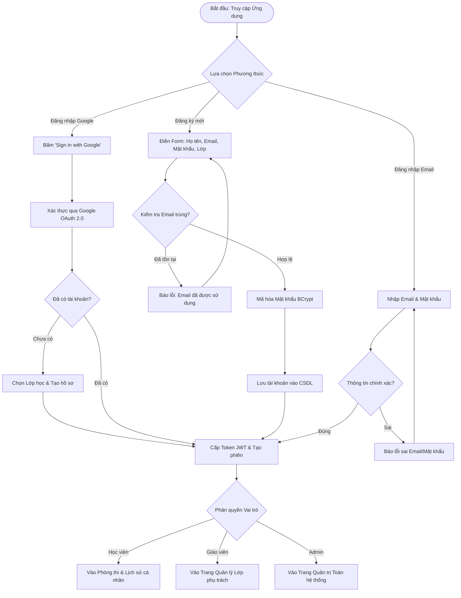

# FLOW 01: Đăng ký & Đăng nhập Hệ thống (Email & Google OAuth)

**Độ phức tạp:** Đơn giản  
**Tác nhân chính (Actors):** Học viên, Giáo viên, Admin  
**Mục tiêu (Purpose):** Quy trình xác thực người dùng bắt buộc trước khi tham gia bất kỳ hoạt động nào trên ứng dụng. Hỗ trợ đăng ký tài khoản (chọn lớp học) hoặc đăng nhập nhanh 1-chạm qua Google OAuth 2.0, sau đó điều hướng chính xác vào phân hệ chức năng theo vai trò.  

---

## 1. Sơ đồ Quy trình (Flowchart)

---

## 2. Mô tả Chi tiết Từng bước (Step-by-Step Execution)

### Bước 1: Truy cập cổng ứng dụng Exam-App
* **Tác nhân thực hiện:** Người dùng (Khởi đầu)
* **Mô tả chi tiết:** Người dùng mở ứng dụng trên trình duyệt hoặc điện thoại. Hệ thống kiểm tra phiên đăng nhập: nếu chưa đăng nhập, tự động chuyển về màn hình Authentication.
* **Giao diện trực quan (UI View):** Màn hình chào mừng với 2 tab: 'Đăng nhập' và 'Đăng ký', kèm nút nổi bật 'Sign in with Google'.

### Bước 2: Lựa chọn hình thức xác thực
* **Tác nhân thực hiện:** Người dùng (Lựa chọn)
* **Mô tả chi tiết:** Người dùng chọn 1 trong 3 cách: (A) Đăng nhập nhanh Google, (B) Đăng nhập tài khoản Email/Password có sẵn, hoặc (C) Đăng ký tài khoản mới.
* **Giao diện trực quan (UI View):** Nút Google với icon G-color, form nhập Email/Password, hoặc link 'Chưa có tài khoản? Đăng ký ngay'.

### Bước 3: Xử lý thông tin và Phân lớp
* **Tác nhân thực hiện:** Người dùng & Hệ thống (Nhập liệu)
* **Mô tả chi tiết:** Nếu đăng ký mới, thí sinh bắt buộc phải chọn Lớp học (ví dụ: 10A1, 11B2). Hệ thống kiểm tra tính duy nhất của Email và mã hóa mật khẩu bảo mật (BCrypt).
* **Giao diện trực quan (UI View):** Dropdown chọn Lớp học, thanh đo độ mạnh mật khẩu, thông báo lỗi màu đỏ nếu email đã tồn tại.

### Bước 4: Cấp phiên làm việc (JWT Session)
* **Tác nhân thực hiện:** Hệ thống (Xác thực)
* **Mô tả chi tiết:** Hệ thống sinh chuỗi JWT Token chứa thông tin User ID, Vai trò (Role: Student / Teacher / Admin) và danh sách lớp phụ trách/tham gia.
* **Giao diện trực quan (UI View):** Hiển thị biểu tượng tải nhanh (Loading Spinner) dưới 0.5 giây.

### Bước 5: Điều hướng vào màn hình tương ứng theo vai trò
* **Tác nhân thực hiện:** Hệ thống (Điều hướng)
* **Mô tả chi tiết:** Học viên được chuyển đến Màn hình chọn môn thi & Lịch sử cá nhân; Giáo viên được chuyển vào Dashboard Lớp phụ trách; Admin chuyển vào Bảng điều khiển Quản trị toàn hệ thống.
* **Giao diện trực quan (UI View):** Giao diện chính tương ứng với avatar người dùng, tên người dùng và vai trò hiển thị ở góc trên bên phải.

---

## 3. Quy tắc Nghiệp vụ Cần Ghi nhớ (Business Rules)

* Bắt buộc đăng nhập: Tuyệt đối không cho phép khách vãng lai (ẩn danh) tham gia làm bài thi.
* Mỗi học viên bắt buộc phải liên kết với một lớp học cụ thể để phục vụ việc tổng hợp báo cáo và phân tích kết quả sau này.
* Tài khoản Giáo viên và Admin do Ban quản trị cấp hoặc phê duyệt phân quyền.
