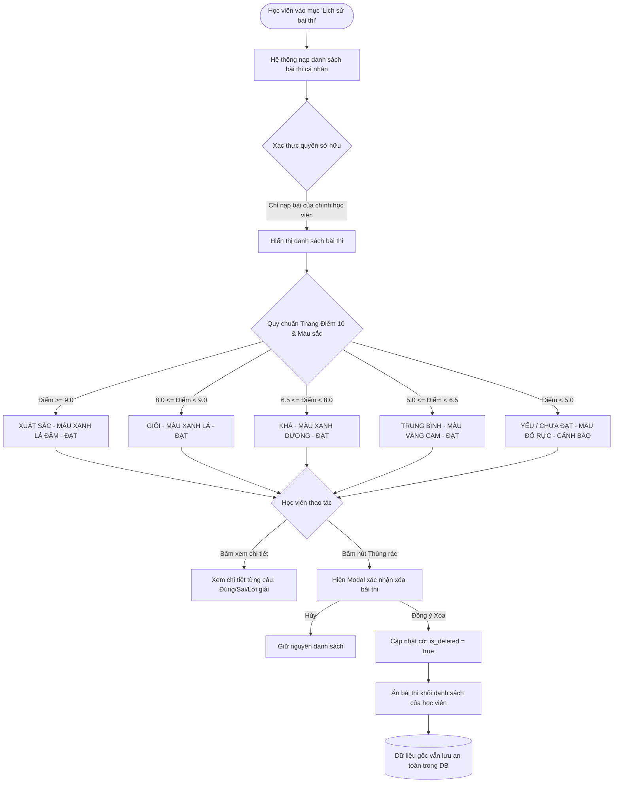

# FLOW 02: Xem Lịch sử Thi, Bảng Xếp Loại & Xóa Mềm Bài Thi

**Độ phức tạp:** Đơn giản  
**Tác nhân chính (Actors):** Học viên (Student)  
**Mục tiêu (Purpose):** Học viên tự theo dõi kết quả các bài thi đã làm kèm xếp loại học lực theo thang điểm chuẩn 10, nhận diện nhanh bằng mã màu Xanh (Đạt >= 5.0đ) / Đỏ (Chưa đạt < 5.0đ), xem chi tiết câu sai và thực hiện xóa mềm (Soft Delete) để ẩn bài thi khỏi danh sách cá nhân.  

---

## 1. Sơ đồ Quy trình (Flowchart)

---

## 2. Mô tả Chi tiết Từng bước (Step-by-Step Execution)

### Bước 1: Mở tab 'Lịch sử làm bài'
* **Tác nhân thực hiện:** Học viên (Truy cập)
* **Mô tả chi tiết:** Học viên chọn mục Lịch sử thi. Hệ thống kiểm tra quyền: chỉ truy vấn các bài thi của chính tài khoản này (chặn tuyệt đối xem bài thi của bạn khác).
* **Giao diện trực quan (UI View):** Thanh menu với biểu tượng đồng hồ 'Lịch sử thi', danh sách bài thi xếp theo thứ tự mới nhất.

### Bước 2: Áp dụng thang điểm 10 và Phân loại học lực
* **Tác nhân thực hiện:** Hệ thống (Quy chuẩn điểm)
* **Mô tả chi tiết:** Hệ thống đối chiếu điểm số với thang điểm 10 chuẩn: Xuất sắc (9.0-10), Giỏi (8.0-8.9), Khá (6.5-7.9), Trung bình (5.0-6.4), Yếu (<5.0).
* **Giao diện trực quan (UI View):** Huy hiệu xếp loại học lực nổi bật cạnh điểm số.

### Bước 3: Hiển thị danh sách đề thi kèm mã màu Xanh - Đỏ
* **Tác nhân thực hiện:** Hệ thống (Trực quan hóa)
* **Mô tả chi tiết:** Mỗi bài thi hiển thị thành 1 thẻ: Thẻ VIỀN XANH (Điểm >= 5.0đ - ĐẠT); Thẻ VIỀN ĐỎ (Điểm < 5.0đ - CHƯA ĐẠT) giúp nhận diện ngay bộ đề chưa làm tốt.
* **Giao diện trực quan (UI View):** Thẻ xanh lá tươi sáng với icon tích xanh; thẻ đỏ rực với icon cảnh báo cần ôn luyện lại.

### Bước 4: Bấm xem lại bài thi đã làm
* **Tác nhân thực hiện:** Học viên (Xem chi tiết)
* **Mô tả chi tiết:** Học viên bấm vào từng đề thi để xem danh sách câu hỏi, phương án mình đã chọn, đáp án đúng của hệ thống và giải thích chi tiết vì sao đúng.
* **Giao diện trực quan (UI View):** Màn hình chi tiết: Câu đúng có tích xanh, câu sai có dấu X đỏ kèm ô lời giải thích chi tiết.

### Bước 5: Xóa bài thi cũ bằng cơ chế Xóa mềm (Soft Delete)
* **Tác nhân thực hiện:** Học viên & Hệ thống (Xóa mềm)
* **Mô tả chi tiết:** Học viên bấm icon thùng rác và xác nhận. Hệ thống cập nhật `is_deleted = true`, ẩn bài thi khỏi màn hình học viên nhưng bảo lưu trong CSDL cho Giáo viên/Admin.
* **Giao diện trực quan (UI View):** Hộp thoại xác nhận và thông báo 'Đã ẩn bài thi khỏi lịch sử cá nhân thành công'.

---

## 3. Quy tắc Nghiệp vụ Cần Ghi nhớ (Business Rules)

* Quy chuẩn Thang điểm 10: Xuất sắc (>=9.0), Giỏi (8.0-8.9), Khá (6.5-7.9), Trung bình (5.0-6.4), Yếu (<5.0).
* Ngưỡng Đạt (Pass Threshold) mặc định là 5.0 điểm. Điểm >= 5.0 hiển thị màu XANH; Điểm < 5.0 hiển thị màu ĐỎ.
* Cơ chế Xóa mềm (Soft Delete) là bắt buộc: Không bao giờ xóa cứng khỏi cơ sở dữ liệu.
