# FLOW 03: Chế độ Thi Thử & Tương tác Trợ lý Chatbot AI

**Độ phức tạp:** Trung bình  
**Tác nhân chính (Actors):** Học viên (Student)  
**Mục tiêu (Purpose):** Cung cấp không gian tự học và ôn luyện không áp lực thời gian. Hệ thống khởi tạo lượt thi qua RPC bảo mật, lưu đáp án từng câu qua RPC, phản hồi đáp án chuẩn xác (với câu hỏi nhiều đáp án: phản hồi sau khi bấm "Kiểm tra đáp án" để chống lộ đáp án trước), kèm theo lời giải chi tiết và tính năng tương tác với Trợ lý AI Chatbot để giải thích cặn kẽ bản chất học thuật của câu hỏi. Kết thúc bài thi thử được chấm điểm và ghi nhận vào lịch sử học tập.  

---

## 1. Sơ đồ Quy trình (Flowchart)

```mermaid
flowchart TD
    Start([Học viên chọn Môn thi: Hóa / Sinh / Anh]) --> ChooseMode[Chọn Chế độ: 'THI THỬ']
    ChooseMode --> CallStartRPC[Gọi RPC fn_start_exam: p_exam_config_id, mode: practice]
    CallStartRPC --> FetchPractice[Hệ thống tạo attempt & bốc ngẫu nhiên câu hỏi]
    FetchPractice --> RenderQ[Hiển thị câu hỏi + Công thức LaTeX + Các phương án]
    
    RenderQ --> CheckQType{Loại câu hỏi?}
    
    CheckQType -->|Đơn đáp án - Radio| SelectSingle[Học viên chọn 1 đáp án]
    SelectSingle --> SaveSingleRPC[Gọi RPC fn_save_answer lưu đáp án]
    SaveSingleRPC --> InstantFeedback
    
    CheckQType -->|Nhiều đáp án - Checkbox| SelectMulti[Học viên tích chọn các phương án]
    SelectMulti --> ClickVerify[Học viên bấm nút 'Kiểm tra đáp án']
    ClickVerify --> SaveMultiRPC[Gọi RPC fn_save_answer lưu đáp án]
    SaveMultiRPC --> InstantFeedback
    
    InstantFeedback{Hệ thống Đánh giá & Phản hồi}
    InstantFeedback --> HighlightGreen[Đáp án Đúng: PHÁT SÁNG XANH LÁ]
    InstantFeedback --> HighlightRed[Đáp án Chọn Sai: HIỆN ICON DẤU X ĐỎ]
    HighlightGreen --> ShowExplain[Hiện ngay Lời giải thích chi tiết phía dưới]
    HighlightRed --> ShowExplain
    
    ShowExplain --> AskAIChoice{Học viên có thắc mắc thêm?}
    AskAIChoice -->|Không| NextQuestion[Bấm 'Câu tiếp theo' -> Tiếp tục luyện tập]
    AskAIChoice -->|Có| OpenAIChat[Bấm nút 'Hỏi Trợ lý AI']
    
    OpenAIChat --> TypePrompt[Gõ câu hỏi: 'Tại sao chất X không tác dụng với Y?']
    TypePrompt --> AICall[Hệ thống gửi câu hỏi + Ngữ cảnh đề bài lên AI Model]
    AICall --> AIResponse[Chatbot AI diễn giải cặn kẽ bản chất học thuật]
    AIResponse --> NextQuestion
    NextQuestion --> CheckFinished{Đã hoàn thành số câu?}
    CheckFinished -->|Chưa| RenderQ
    CheckFinished -->|Đã xong / Nộp bài| CallSubmitRPC[Gọi RPC fn_submit_exam_attempt chấm điểm & lưu kết quả]
    CallSubmitRPC --> SummaryView[Hiển thị Bảng tổng kết buổi luyện tập & Lưu vào Lịch sử thi]
```

---

## 2. Mô tả Chi tiết Từng bước (Step-by-Step Execution)

### Bước 1: Chọn môn học và khởi tạo lượt thi thử qua RPC bảo mật
* **Tác nhân thực hiện:** Học viên & Hệ thống (Khởi động qua RPC)
* **Mô tả chi tiết:** Học viên lựa chọn môn học (Hóa học, Sinh học hoặc Tiếng Anh) và bấm nút 'Luyện tập / Thi Thử'. Do quyền direct INSERT trên bảng `exam_attempts` bị khóa 100%, Frontend gọi RPC bảo mật `fn_start_exam(p_exam_config_id, 'practice')`. Hệ thống khởi tạo bản ghi `in_progress`, bốc ngẫu nhiên bộ câu hỏi từ ngân hàng đề và nạp vào `exam_attempt_answers`.
* **Giao diện trực quan (UI View):** Nút chọn chế độ với icon bóng đèn/mũ cử nhân và nhãn 'Thi Thử - Học cùng AI'.

### Bước 2: Hiển thị câu hỏi và công thức Toán - Lý - Hóa
* **Tác nhân thực hiện:** Hệ thống (Nạp đề)
* **Mô tả chi tiết:** Hệ thống hiển thị câu hỏi với đầy đủ công thức hóa học, chỉ số trên/dưới, ký hiệu di truyền hoặc phiên âm tiếng Anh thông qua trình kết xuất LaTeX (Katex/MathJax).
* **Giao diện trực quan (UI View):** Khung câu hỏi đẹp mắt: công thức $Fe + 2HCl \rightarrow FeCl_2 + H_2\uparrow$ hiển thị chuẩn xác.

### Bước 3: Lựa chọn phương án trả lời & Tự động lưu qua RPC `fn_save_answer`
* **Tác nhân thực hiện:** Học viên & Hệ thống (Thao tác & Lưu trữ an toàn)
* **Mô tả chi tiết:**
  - **Với câu hỏi 1 đáp án (Radio):** Học viên chọn một đáp án. Hệ thống gọi RPC `fn_save_answer(p_attempt_id, p_question_id, p_selected_option_ids)` để lưu phương án lên CSDL, sau đó lập tức hiển thị phản hồi đúng/sai.
  - **Với câu hỏi nhiều đáp án (Checkbox):** Học viên tích chọn các phương án theo suy đoán. Hệ thống **chưa hiển thị kết quả ngay** (để chống lộ đáp án của các ô còn lại). Học viên hoàn tất lựa chọn rồi bấm nút **"Kiểm tra đáp án"**, hệ thống gọi RPC `fn_save_answer` lưu dữ liệu và hiển thị đánh giá toàn diện.
* **Giao diện trực quan (UI View):** Ô lựa chọn có hiệu ứng hover mượt mà; câu nhiều đáp án hiển thị nút màu xanh mòng két "Kiểm tra đáp án".

### Bước 4: Phản hồi trực quan & Hiển thị giải thích chi tiết
* **Tác nhân thực hiện:** Hệ thống (Phản hồi trực quan)
* **Mô tả chi tiết:** Khi kiểm tra: các phương án đúng phát sáng màu xanh lá; các phương án thí sinh chọn sai hiển thị icon [X] đỏ. Khung giải thích chi tiết mở ra ngay phía dưới giúp học viên nắm bắt kiến thức tức thì.
* **Giao diện trực quan (UI View):** Phương án đúng: viền xanh lá, nền xanh nhạt rực sáng. Phương án sai: viền đỏ + icon [X] đỏ.

### Bước 5: Hỏi đáp chuyên sâu với Trợ lý Chatbot AI
* **Tác nhân thực hiện:** Học viên & AI Chatbot (Tương tác AI)
* **Mô tả chi tiết:** Nếu chưa hiểu bản chất lời giải, học viên bấm 'Hỏi Trợ lý AI'. Một cửa sổ chat pop-up mở ra, học viên nhập thắc mắc mở, AI được nạp sẵn ngữ cảnh câu hỏi hiện tại và giải đáp cặn kẽ bản chất học thuật.
* **Giao diện trực quan (UI View):** Cửa sổ chat pop-up bên phải màn hình. AI diễn giải chi tiết kèm ví dụ thực tế.

### Bước 6: Hoàn tất buổi luyện tập & Chấm điểm qua RPC `fn_submit_exam_attempt`
* **Tác nhân thực hiện:** Học viên & Hệ thống (Chấm điểm & Lưu trữ)
* **Mô tả chi tiết:** Sau khi hoàn thành các câu hỏi hoặc muốn kết thúc buổi luyện tập, học viên bấm "Hoàn thành". Hệ thống gọi RPC `fn_submit_exam_attempt(p_attempt_id, p_answers, false)` để chấm điểm tự động, cập nhật trạng thái `completed`, và ghi nhận điểm số vào lịch sử học tập cá nhân và thống kê lớp.
* **Giao diện trực quan (UI View):** Bảng tổng kết kết quả thi thử: số câu đúng, tỉ lệ phần trăm, điểm quy đổi thang 10 kèm nút quay lại ôn tập hoặc làm lại đề mới.

---

## 3. Quy tắc Nghiệp vụ Cần Ghi nhớ (Business Rules)

* **Bảo mật CSDL 100% qua RPC:** Học viên bị khóa toàn bộ quyền direct INSERT/UPDATE trên bảng `exam_attempts` và `exam_attempt_answers`. Mọi thao tác bắt buộc gọi qua các hàm RPC `fn_start_exam`, `fn_save_answer`, `fn_submit_exam_attempt`.
* **Không áp lực thời gian:** Chế độ Thi Thử không đếm ngược tự nộp bài.
* **Chống lộ đáp án câu nhiều lựa chọn:** Tuyệt đối không phản hồi màu sắc từng ô khi học sinh chưa bấm "Kiểm tra đáp án" đối với câu multi-choice.
* **Lưu lịch sử & Thống kê:** Kết quả thi thử CÓ tính vào lịch sử cá nhân và báo cáo thống kê tiến độ học sinh.
* **Tự động gợi ý AI:** Lời giải thích luôn đi kèm nút kích hoạt Chatbot AI được nạp sẵn ngữ cảnh câu hỏi hiện tại.
