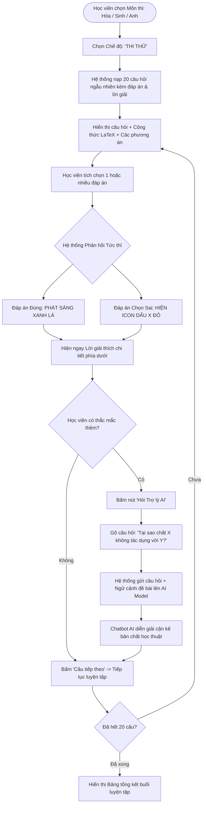

# FLOW 03: Chế độ Thi Thử & Tương tác Trợ lý Chatbot AI

**Độ phức tạp:** Trung bình  
**Tác nhân chính (Actors):** Học viên (Student)  
**Mục tiêu (Purpose):** Cung cấp không gian tự học và ôn luyện không áp lực thời gian. Hệ thống phản hồi đáp án đúng/sai ngay lập tức khi học viên chọn, kèm theo lời giải chi tiết và tính năng tương tác với Trợ lý AI Chatbot để giải thích cặn kẽ bản chất học thuật của câu hỏi.  

---

## 1. Sơ đồ Quy trình (Flowchart)

---

## 2. Mô tả Chi tiết Từng bước (Step-by-Step Execution)

### Bước 1: Chọn môn học và bắt đầu chế độ Thi Thử
* **Tác nhân thực hiện:** Học viên (Khởi động)
* **Mô tả chi tiết:** Học viên lựa chọn môn học (Hóa học, Sinh học hoặc Tiếng Anh) và bấm nút 'Luyện tập / Thi Thử'.
* **Giao diện trực quan (UI View):** Nút chọn chế độ với icon bóng đèn/mũ cử nhân và nhãn 'Thi Thử - Học cùng AI'.

### Bước 2: Hiển thị câu hỏi và công thức Toán - Lý - Hóa
* **Tác nhân thực hiện:** Hệ thống (Nạp đề)
* **Mô tả chi tiết:** Hệ thống hiển thị câu hỏi với đầy đủ công thức hóa học, chỉ số trên/dưới, ký hiệu di truyền hoặc phiên âm tiếng Anh thông qua trình kết xuất LaTeX.
* **Giao diện trực quan (UI View):** Khung câu hỏi đẹp mắt: công thức $Fe + 2HCl \rightarrow FeCl_2 + H_2\uparrow$ hiển thị chuẩn xác.

### Bước 3: Tích chọn phương án trả lời
* **Tác nhân thực hiện:** Học viên (Thao tác)
* **Mô tả chi tiết:** Học viên tích chọn 1 đáp án (Radio) hoặc nhiều đáp án (Checkbox) tùy theo yêu cầu của câu hỏi.
* **Giao diện trực quan (UI View):** Các ô lựa chọn A, B, C, D với hiệu ứng hover mượt mà.

### Bước 4: Phản hồi tức thì & Hiển thị giải thích
* **Tác nhân thực hiện:** Hệ thống (Phản hồi trực quan)
* **Mô tả chi tiết:** Ngay khi tích chọn: đáp án đúng phát sáng xanh lá; nếu chọn sai, phương án sai hiển thị dấu [X] đỏ. Khung giải thích chi tiết lập tức mở ra phía dưới.
* **Giao diện trực quan (UI View):** Phương án đúng: viền xanh lá, nền xanh nhạt rực sáng. Phương án sai: viền đỏ + icon [X] đỏ.

### Bước 5: Hỏi đáp chuyên sâu với Trợ lý Chatbot AI
* **Tác nhân thực hiện:** Học viên & AI Chatbot (Tương tác AI)
* **Mô tả chi tiết:** Nếu chưa hiểu bản chất, học viên bấm 'Hỏi Trợ lý AI'. Một cửa sổ chat pop-up mở ra, học viên nhập thắc mắc mở, AI giải đáp cặn kẽ.
* **Giao diện trực quan (UI View):** Cửa sổ chat pop-up bên phải màn hình. AI diễn giải chi tiết bản chất lý thuyết kèm ví dụ.

---

## 3. Quy tắc Nghiệp vụ Cần Ghi nhớ (Business Rules)

* Không áp lực thời gian: Chế độ Thi Thử không đếm ngược tự nộp bài.
* Đáp án đúng và lời giải thích luôn hiển thị ngay lập tức để học sinh ghi nhớ kiến thức.
* AI Chatbot được cung cấp ngữ cảnh đề bài để trả lời bám sát kiến thức môn học.
