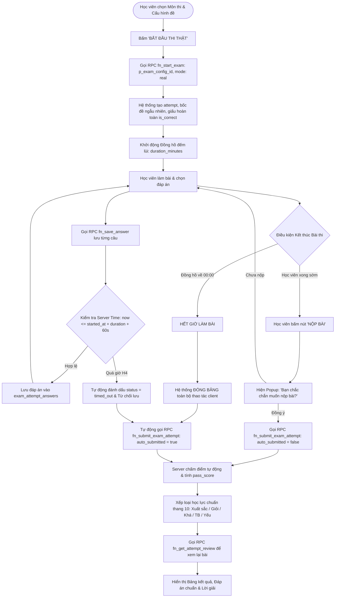

# FLOW 04: Chế độ Thi Thật & Tự Động Nộp Bài khi Hết Giờ

**Độ phức tạp:** Nâng cao (Bảo mật tuyệt đối)  
**Tác nhân chính (Actors):** Học viên & Hệ thống  
**Mục tiêu (Purpose):** Tổ chức thi chính quy nghiêm ngặt. Khóa 100% quyền direct INSERT/UPDATE bảng CSDL, quản trị toàn bộ phiên thi qua các RPC bảo mật (`fn_start_exam`, `fn_save_answer`, `fn_submit_exam_attempt`, `fn_get_attempt_review`), đảm bảo tính bảo mật tối đa (chống F12 soi đáp án), đếm lùi thời gian thực kèm kiểm tra thời gian Server-side, tự động lưu tiến độ và tự động khóa màn hình thu bài khi hết giờ (00:00).  

---

## 1. Sơ đồ Quy trình (Flowchart)

---

## 2. Mô tả Chi tiết Từng bước (Step-by-Step Execution)

### Bước 1: Khởi động phòng thi thật qua RPC bảo mật `fn_start_exam`
* **Tác nhân thực hiện:** Học viên & Hệ thống (Khởi tạo phiên thi)
* **Mô tả chi tiết:** Học viên xác nhận sẵn sàng làm bài. Do quyền direct INSERT trên bảng `exam_attempts` bị khóa 100% bằng RLS, Frontend gọi RPC bảo mật `fn_start_exam(p_exam_config_id, 'real')`. RPC này thiết lập `started_at = now()`, `total_questions` và `pass_score` cố định theo cấu hình Admin (ngăn chặn triệt để lỗ hổng H1 - tự tạo bài điểm 10, và H2 - tự giảm số câu để hack điểm), đồng thời tự động bốc ngẫu nhiên câu hỏi chèn vào `exam_attempt_answers`.
* **Giao diện trực quan (UI View):** Giao diện phòng thi toàn màn hình (Full-screen mode), hộp thoại nhắc nhở quy chế thi và thời gian làm bài.

### Bước 2: Nạp câu hỏi bảo mật & Kích hoạt đồng hồ đếm lùi (Chống F12)
* **Tác nhân thực hiện:** Hệ thống (Bảo mật chống gian lận)
* **Mô tả chi tiết:** Hệ thống trả danh sách câu hỏi về máy học viên. Cột `is_correct` và `explanation` tuyệt đối không được gửi về client (chống hoàn toàn lỗ hổng H3 - dùng F12 DevTools soi đáp án). Đồng hồ đếm lùi bắt đầu chạy đồng bộ theo số phút quy định.
* **Giao diện trực quan (UI View):** Thanh Header phòng thi: Đồng hồ đếm ngược to rõ đổi sang màu vàng khi còn dưới 5 phút và nhấp nháy đỏ khi còn 1 phút cuối.

### Bước 3: Làm bài & Lưu tiến độ qua RPC `fn_save_answer` với Server-side Timer
* **Tác nhân thực hiện:** Học viên & Hệ thống (Làm bài & Auto-save an toàn)
* **Mô tả chi tiết:** Học viên chọn đáp án (hỗ trợ 1 đáp án hoặc nhiều đáp án). Mỗi lựa chọn được gửi qua RPC `fn_save_answer(p_attempt_id, p_question_id, p_selected_option_ids)`. RPC kiểm tra nghiêm ngặt thời gian máy chủ: `EXTRACT(EPOCH FROM (now() - started_at)) <= duration_minutes * 60 + 60s`. Nếu phát hiện quá giờ, server tự động chuyển bài thi sang `timed_out` và từ chối lưu đáp án (ngăn chặn triệt để gian lận H4 - chỉnh đồng hồ máy khách để làm bài sau khi hết giờ).
* **Giao diện trực quan (UI View):** Ma trận tiến độ bên cạnh: câu đã lưu chuyển màu xanh ngọc, câu chưa làm màu xám tro, chỉ báo 'Đã lưu' hiển thị sau mỗi thao tác.

### Bước 4: Nộp bài chủ động hoặc Tự động thu bài khi hết giờ
* **Tác nhân thực hiện:** Học viên / Hệ thống (Thu bài qua RPC)
* **Mô tả chi tiết:**
  - **Nộp bài chủ động:** Nếu làm xong sớm, học viên bấm 'Nộp bài', xác nhận hộp thoại modal. Frontend gọi RPC `fn_submit_exam_attempt(p_attempt_id, p_answers, false)`.
  - **Tự động nộp khi hết giờ (00:00):** Hệ thống lập tức đóng băng toàn bộ thao tác click chuột/bàn phím và tự động gọi RPC `fn_submit_exam_attempt(p_attempt_id, p_answers, true)`.
* **Giao diện trực quan (UI View):** Modal xác nhận nộp bài, hoặc màn hình đếm ngược về 00:00 hiển thị thông báo: 'Đã hết thời gian làm bài! Hệ thống đang tự động nộp bài của bạn...'.

### Bước 5: Chấm điểm tự động trên Server, Xếp loại học lực & Xem lại bài thi
* **Tác nhân thực hiện:** Máy chủ & Học viên (Chấm điểm & Công bố)
* **Mô tả chi tiết:** Hàm `fn_submit_exam_attempt` chạy trên PostgreSQL tự động đối chiếu các phương án đã chọn với `question_options`, tính điểm chính xác trên thang 10: `score = ROUND((correct_count::NUMERIC / total_questions) * 10, 2)` (chống việc bỏ trắng câu vẫn đạt điểm tối đa), đánh giá `is_passed` theo `pass_score`, và cập nhật trạng thái `completed`/`timed_out`. Sau khi nộp bài thành công, học viên gọi RPC `fn_get_attempt_review(p_attempt_id)` (kiểm tra quyền sở hữu chính chủ) để xem chi tiết đáp án đúng và lời giải thích.
* **Giao diện trực quan (UI View):** Trang kết quả: Điểm số to rõ (ví dụ: '8.5 / 10'), Huy hiệu Xếp loại 'GIỎI' (Xanh lá), thống kê số câu đúng/sai, cùng bảng chi tiết bài làm kèm lời giải sư phạm cặn kẽ.

---

## 3. Quy tắc Nghiệp vụ Cần Ghi nhớ (Business Rules)

* **Khóa 100% quyền direct INSERT/UPDATE:** Học viên không có quyền ghi trực tiếp vào các bảng `exam_attempts` và `exam_attempt_answers`. Toàn bộ hoạt động thực hiện qua 4 RPC bảo mật.
* **Triệt tiêu 4 lỗ hổng bảo mật cốt lõi (H1 - H4):**
  - **H1 (Chống sửa điểm):** Điểm số được tính toán và ghi nhận 100% trên Server PostgreSQL, không nhận điểm từ Client.
  - **H2 (Chống hack số câu hỏi):** `total_questions` và `pass_score` được cố định từ `exam_configs` khi gọi `fn_start_exam`.
  - **H3 (Chống xem trộm F12):** API thi không chứa cột `is_correct` và `explanation`.
  - **H4 (Chống gian lận hết giờ):** `fn_save_answer` kiểm tra mốc thời gian Server thực tế (`started_at`), từ chối lưu bài nếu vượt quá thời lượng thi.
* **Đồng bộ bài thi tự động nộp (timed_out):** Bài thi bị nộp do hết giờ vẫn được tính điểm đầy đủ trên các câu đã lưu và hiển thị trong Bảng xếp hạng và Báo cáo giáo viên.
* **Bảo vệ quyền riêng tư bài thi:** RPC `fn_get_attempt_review` chỉ cho phép chính chủ học sinh hoặc Giáo viên phụ trách bộ môn xem chi tiết bài làm.
