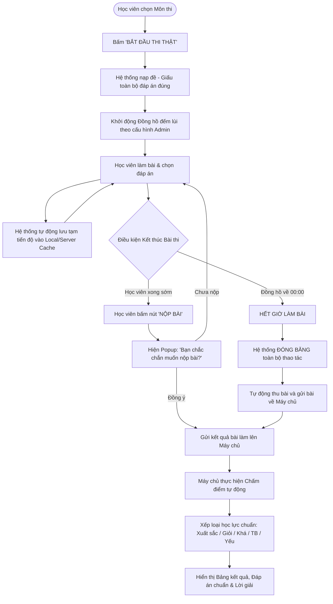

# FLOW 04: Chế độ Thi Thật & Tự Động Nộp Bài khi Hết Giờ

**Độ phức tạp:** Trung bình  
**Tác nhân chính (Actors):** Học viên & Hệ thống  
**Mục tiêu (Purpose):** Tổ chức thi chính quy nghiêm ngặt. Đảm bảo tính bảo mật tối đa (không gửi đáp án về client), đếm lùi thời gian thực, tự động lưu tạm tiến độ bài làm và tự động khóa màn hình thu bài khi hết giờ (00:00).  

---

## 1. Sơ đồ Quy trình (Flowchart)

---

## 2. Mô tả Chi tiết Từng bước (Step-by-Step Execution)

### Bước 1: Bấm nút 'Bắt đầu Thi Thật'
* **Tác nhân thực hiện:** Học viên (Bắt đầu)
* **Mô tả chi tiết:** Học viên xác nhận sẵn sàng làm bài. Hệ thống chuyển sang giao diện phòng thi toàn màn hình, thiết lập các biện pháp chống gian lận.
* **Giao diện trực quan (UI View):** Hộp thoại thông báo: 'Thời gian làm bài và số câu hỏi theo quy định. Bài thi sẽ tự động nộp khi hết giờ!'.

### Bước 2: Nạp câu hỏi bảo mật & Bật đồng hồ đếm lùi
* **Tác nhân thực hiện:** Hệ thống (Bảo mật)
* **Mô tả chi tiết:** Máy chủ gửi câu hỏi về máy học viên. Toàn bộ đáp án đúng bị ẩn hoàn toàn (không lưu trong HTML/JS để chống F12 gian lận). Đồng hồ đếm lùi bắt đầu chạy liên tục.
* **Giao diện trực quan (UI View):** Header phòng thi: Đồng hồ đếm ngược to rõ đổi màu vàng khi còn 5 phút và nhấp nháy đỏ khi còn 1 phút.

### Bước 3: Làm bài và Tự động lưu tiến độ liên tục
* **Tác nhân thực hiện:** Học viên & Hệ thống (Làm bài & Auto-save)
* **Mô tả chi tiết:** Học viên tích chọn đáp án (hỗ trợ câu 1 hoặc nhiều đáp án). Mỗi lần chọn, hệ thống tự động lưu tạm (Auto-save) lên bộ nhớ đệm chống mất bài nếu rớt mạng.
* **Giao diện trực quan (UI View):** Danh sách ma trận câu hỏi bên cạnh: câu đã làm đổi màu xanh, câu chưa làm màu xám.

### Bước 4: Nộp bài chủ động hoặc Tự động nộp khi hết giờ
* **Tác nhân thực hiện:** Học viên / Hệ thống (Kết thúc bài thi)
* **Mô tả chi tiết:** • Nếu làm xong sớm: Bấm nút 'Nộp bài' và xác nhận.\n• Nếu hết giờ (00:00): Hệ thống lập tức khóa màn hình, vô hiệu hóa click và tự động gửi toàn bộ bài làm về máy chủ.
* **Giao diện trực quan (UI View):** Thông báo: 'Đã hết thời gian làm bài! Hệ thống đang tự động nộp bài của bạn...'.

### Bước 5: Chấm điểm tự động & Hiển thị kết quả chi tiết
* **Tác nhân thực hiện:** Hệ thống (Chấm điểm & Công bố)
* **Mô tả chi tiết:** Máy chủ đối chiếu đáp án, tính tổng điểm trên thang điểm 10, xếp loại học lực chuẩn, công bố điểm số kèm đáp án chuẩn và lời giải thích chi tiết.
* **Giao diện trực quan (UI View):** Trang tổng kết: Điểm số to rõ (ví dụ: '8.5 / 10'), Xếp loại 'GIỎI', bảng chi tiết từng câu kèm đáp án đúng màu xanh và lời giải chi tiết.

---

## 3. Quy tắc Nghiệp vụ Cần Ghi nhớ (Business Rules)

* Bảo mật tuyệt đối: Ở chế độ Thi Thật, đáp án đúng không được gửi về trình duyệt trước khi nộp bài.
* Tự động thu bài là bắt buộc: Khi đồng hồ về 00:00, không cho phép chọn thêm đáp án.
* Cơ chế Auto-save đảm bảo học sinh mất mạng vẫn có thể tải lại trang và tiếp tục làm bài trong khoảng thời gian còn lại.
