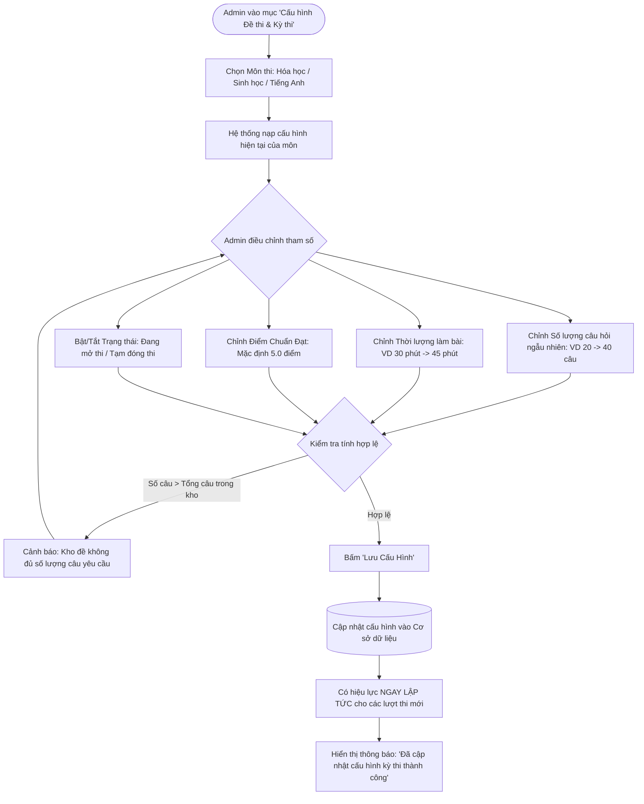

# FLOW 05: Admin Cấu Hình Đề Thi & Tham Số Kỳ Thi

**Độ phức tạp:** Trung bình  
**Tác nhân chính (Actors):** Quản trị viên (Admin)  
**Mục tiêu (Purpose):** Cho phép Admin chủ động tùy biến các tham số kỳ thi cho từng môn học: số lượng câu hỏi rút ngẫu nhiên, thời lượng làm bài thi, điểm chuẩn đạt và trạng thái đóng/mở thi. Mọi thay đổi có hiệu lực ngay lập tức cho các lượt thi tiếp theo.  

---

## 1. Sơ đồ Quy trình (Flowchart)

---

## 2. Mô tả Chi tiết Từng bước (Step-by-Step Execution)

### Bước 1: Mở trang Cấu hình Đề thi & Kỳ thi
* **Tác nhân thực hiện:** Admin (Truy cập)
* **Mô tả chi tiết:** Admin truy cập mục Cấu hình hệ thống. Màn hình hiển thị danh sách 3 môn học (Hóa, Sinh, Tiếng Anh) kèm các thông số hiện tại.
* **Giao diện trực quan (UI View):** Bảng điều khiển với 3 thẻ môn học, hiển thị số câu hiện tại, thời lượng và trạng thái kỳ thi.

### Bước 2: Tùy biến Số lượng câu hỏi và Thời lượng thi
* **Tác nhân thực hiện:** Admin (Thiết lập)
* **Mô tả chi tiết:** Admin chọn môn thi, nhập số lượng câu hỏi (ví dụ: đổi từ 20 câu thành 40 câu) và thời lượng làm bài (ví dụ: đổi từ 30 phút thành 45 phút).
* **Giao diện trực quan (UI View):** Ô nhập số câu hỏi (có nút tăng giảm), ô nhập thời gian (phút), thanh trượt chọn điểm chuẩn đạt.

### Bước 3: Kiểm tra tính khả dụng của ngân hàng đề
* **Tác nhân thực hiện:** Hệ thống (Kiểm tra)
* **Mô tả chi tiết:** Hệ thống tự động kiểm tra số lượng câu hỏi hiện có trong kho đề của môn đó: nếu số câu yêu cầu lớn hơn số câu thực tế trong kho, hệ thống cảnh báo Admin bổ sung câu hỏi.
* **Giao diện trực quan (UI View):** Dòng thông báo màu xanh nếu kho đề đủ câu, hoặc cảnh báo màu vàng: 'Kho đề hiện có 120 câu, đủ để tạo đề ngẫu nhiên 40 câu'.

### Bước 4: Lưu cấu hình và Kích hoạt hiệu lực
* **Tác nhân thực hiện:** Admin (Lưu & Kích hoạt)
* **Mô tả chi tiết:** Admin bấm nút 'Lưu cấu hình'. Hệ thống ghi đè tham số mới vào CSDL. Các thí sinh bấm 'Vào thi' sau thời điểm này sẽ nhận đề thi theo thông số mới.
* **Giao diện trực quan (UI View):** Nút bấm 'Lưu cấu hình' có hiệu ứng loading ngắn và thông báo 'Cấu hình mới đã có hiệu lực tức thì!'.

---

## 3. Quy tắc Nghiệp vụ Cần Ghi nhớ (Business Rules)

* Quyền hạn: Chỉ duy nhất tài khoản Quản trị viên (Admin) mới có quyền thay đổi cấu hình kỳ thi.
* Phạm vi hiệu lực: Cấu hình mới áp dụng ngay lập tức cho các lượt bắt đầu thi mới; không ảnh hưởng đến các thí sinh đang trong phòng thi dở dang.
* Số lượng câu hỏi yêu cầu không được vượt quá tổng số câu hỏi đang kích hoạt trong ngân hàng đề của môn đó.
