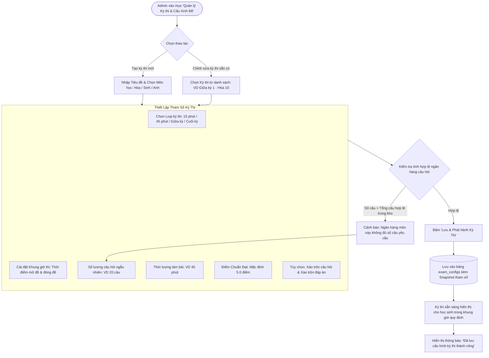

# FLOW 05: Admin Cấu Hình Đề Thi Theo Từng Kỳ Thi & Môn Học

**Độ phức tạp:** Trung bình  
**Tác nhân chính (Actors):** Quản trị viên (Admin)  
**Mục tiêu (Purpose):** Cho phép Admin chủ động thiết lập và tùy biến cấu hình chi tiết cho từng **Kỳ thi / Bài kiểm tra cụ thể** (Kiểm tra 15 phút, 1 tiết 45 phút, Thi giữa kỳ, Cuối kỳ, Khảo sát chất lượng) gắn liền với từng môn học: tiêu đề kỳ thi, thời gian mở/đóng đề thi, số lượng câu hỏi ngẫu nhiên, thời lượng làm bài, điểm chuẩn đạt và trạng thái kích hoạt.  

---

## 1. Sơ đồ Quy trình (Flowchart)

---

## 2. Mô tả Chi tiết Từng bước (Step-by-Step Execution)

### Bước 1: Mở trang Quản lý Kỳ thi & Cấu hình Đề
* **Tác nhân thực hiện:** Admin (Truy cập)
* **Mô tả chi tiết:** Admin truy cập mục Quản lý Kỳ thi. Màn hình hiển thị danh sách các kỳ thi đang diễn ra, sắp diễn ra và kỳ thi định kỳ của 3 môn (Hóa, Sinh, Tiếng Anh).
* **Giao diện trực quan (UI View):** Bảng danh sách kỳ thi phân loại theo môn, hiển thị loại bài thi (15 phút, 1 tiết, Giữa kỳ, Cuối kỳ) và trạng thái Đang mở / Đã đóng.

### Bước 2: Tạo kỳ thi mới hoặc chọn kỳ thi cần điều chỉnh
* **Tác nhân thực hiện:** Admin (Lựa chọn)
* **Mô tả chi tiết:** Admin bấm "Thêm Kỳ Thi Mới" hoặc chọn một kỳ thi hiện có để sửa thông số (ví dụ: "Đề kiểm tra giữa kỳ 1 - Môn Sinh học").
* **Giao diện trực quan (UI View):** Form nhập liệu với các trường: Tiêu đề kỳ thi, Môn học, Học kỳ (Học kỳ 1 / Học kỳ 2).

### Bước 3: Thiết lập tham số chi tiết & Khung thời gian làm bài
* **Tác nhân thực hiện:** Admin (Cấu hình)
* **Mô tả chi tiết:** Admin thiết lập:
  - Loại bài thi: 15 phút / 45 phút / Giữa kỳ / Cuối kỳ.
  - Thời gian mở đề và kết thúc đề (Lịch thi cụ thể).
  - Số lượng câu hỏi rút ngẫu nhiên (VD: 20 câu).
  - Thời lượng đếm lùi (VD: 45 phút).
  - Điểm chuẩn đạt (VD: 5.0 / 10).
  - Bật/tắt xáo trộn câu hỏi và xáo trộn đáp án.
* **Giao diện trực quan (UI View):** Ô chọn ngày giờ (Date-Time Picker), ô nhập số câu và thời gian kèm thanh trượt chọn điểm đạt.

### Bước 4: Kiểm tra tính sẵn sàng của ngân hàng câu hỏi
* **Tác nhân thực hiện:** Hệ thống (Kiểm tra)
* **Mô tả chi tiết:** Hệ thống tự động kiểm tra số lượng câu hỏi đã duyệt (`approved`) trong ngân hàng đề của môn đó: nếu số câu yêu cầu lớn hơn số câu thực tế, hệ thống cảnh báo Admin cần bổ sung câu hỏi trước khi mở thi.
* **Giao diện trực quan (UI View):** Chỉ báo xanh: "Kho đề hiện có 120 câu approved, sẵn sàng cho đề 20 câu ngẫu nhiên".

### Bước 5: Lưu cấu hình và Phát hành kỳ thi
* **Tác nhân thực hiện:** Admin (Lưu & Kích hoạt)
* **Mô tả chi tiết:** Admin bấm 'Lưu & Phát hành'. Hệ thống lưu cấu hình vào bảng `exam_configs`. Khi thí sinh vào thi trong khung giờ mở đề, hệ thống sẽ tự động chụp Snapshot cấu hình này gắn vào bài làm của thí sinh.
* **Giao diện trực quan (UI View):** Thông báo: "Kỳ thi đã được kích hoạt thành công cho học sinh".

---

## 3. Quy tắc Nghiệp vụ Cần Ghi nhớ (Business Rules)

* **Cấu hình theo từng kỳ thi:** Không dùng chung một cấu hình cứng cho cả môn học; mỗi kỳ thi (15 phút, 1 tiết, Giữa kỳ) có tên gọi, lịch thi và thời lượng riêng biệt.
* **Bảo toàn lịch sử qua Snapshot:** Khi học sinh làm bài, toàn bộ cấu hình đề (thời lượng, số câu, điểm đạt, tên kỳ thi) được lưu Snapshot vào `exam_attempts` để bảo đảm tính bất biến kể cả khi Admin chỉnh sửa cấu hình sau này.
* **Khung giờ mở thi:** Học sinh chỉ có thể bấm vào thi trong khoảng thời gian từ `start_time` đến `end_time` được Admin quy định.
