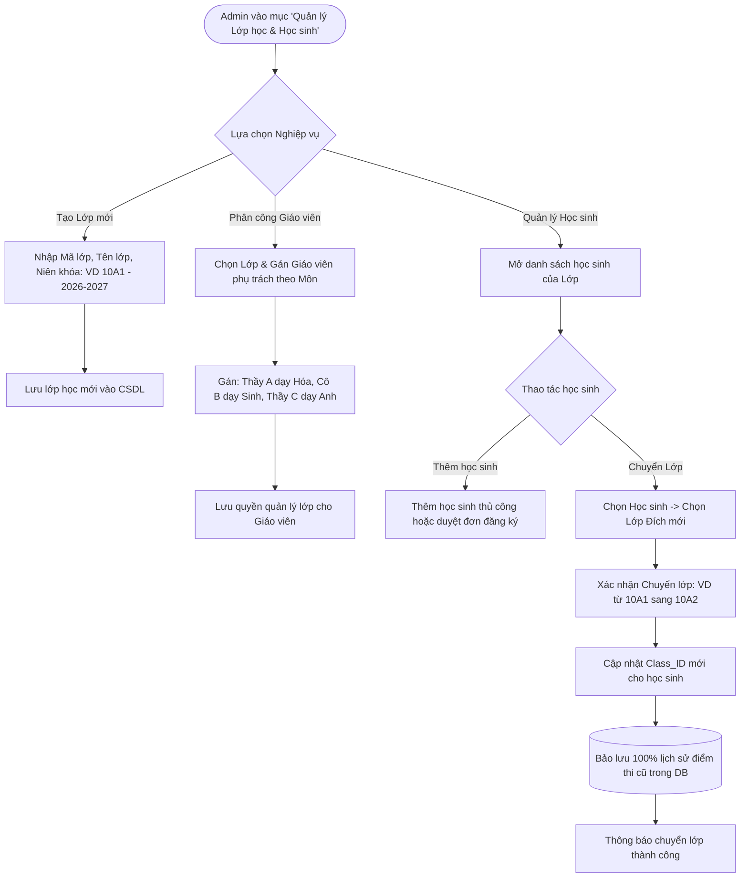

# FLOW 06: Admin Quản Lý Lớp Học, Phân Công Giáo Viên & Chuyển Lớp

**Độ phức tạp:** Khá  
**Tác nhân chính (Actors):** Quản trị viên (Admin)  
**Mục tiêu (Purpose):** Quản lý cơ cấu tổ chức lớp học: Tạo lớp học mới, phân công giáo viên bộ môn phụ trách lớp theo từng môn học (Hóa/Sinh/Anh), quản lý danh sách học sinh và thực hiện chuyển lớp khi có sự điều chuyển mà vẫn bảo lưu toàn vẹn lịch sử bài thi.  

---

## 1. Sơ đồ Quy trình (Flowchart)

---

## 2. Mô tả Chi tiết Từng bước (Step-by-Step Execution)

### Bước 1: Mở danh mục Quản lý Lớp học
* **Tác nhân thực hiện:** Admin (Truy cập)
* **Mô tả chi tiết:** Admin truy cập phân hệ Quản lý Lớp học. Màn hình hiển thị danh sách các lớp học hiện có, số lượng học sinh trong lớp và danh sách giáo viên phụ trách từng môn.
* **Giao diện trực quan (UI View):** Bảng danh sách lớp học hiện đại, có các nút: 'Tạo Lớp mới', 'Phân công Giáo viên', 'Danh sách Học sinh'.

### Bước 2: Tạo mới lớp học và thiết lập niên khóa
* **Tác nhân thực hiện:** Admin (Tạo lớp)
* **Mô tả chi tiết:** Admin bấm 'Tạo lớp mới'. Điền thông tin: Mã lớp (10A1), Tên lớp (Lớp 10A1 Chuyên Tự Nhiên), Niên khóa (2026-2027) -> Bấm Lưu.
* **Giao diện trực quan (UI View):** Modal tạo lớp đơn giản, có ô chọn niên khóa và mô tả ghi chú.

### Bước 3: Phân công Giáo viên bộ môn phụ trách lớp
* **Tác nhân thực hiện:** Admin (Gán giáo viên)
* **Mô tả chi tiết:** Admin chọn lớp và gán giáo viên theo từng môn: ví dụ gán Thầy Nguyễn Văn A phụ trách môn Hóa, Cô Trần Thị B phụ trách môn Sinh.
* **Giao diện trực quan (UI View):** Giao diện phân công trực quan: từng dòng môn học kèm dropdown chọn giáo viên tương ứng.

### Bước 4: Thực hiện Chuyển lớp cho học sinh (Class Transfer)
* **Tác nhân thực hiện:** Admin (Chuyển lớp)
* **Mô tả chi tiết:** Khi học sinh chuyển lớp, Admin chọn học sinh trong danh sách, bấm 'Chuyển lớp' và chọn lớp đích. Hệ thống cập nhật phân lớp mới nhưng vẫn giữ nguyên toàn bộ lịch sử điểm thi của học sinh đó.
* **Giao diện trực quan (UI View):** Hộp thoại xác nhận: 'Chuyển học sinh Lê Văn C từ lớp 10A1 sang lớp 10A2. Lịch sử bài thi sẽ được bảo lưu'.

---

## 3. Quy tắc Nghiệp vụ Cần Ghi nhớ (Business Rules)

* Bảo lưu toàn vẹn dữ liệu: Khi chuyển lớp, không xóa hoặc làm thay đổi điểm số các bài thi cũ của học sinh.
* Phân quyền dữ liệu của Giáo viên: Giáo viên chỉ được xem điểm và danh sách học sinh của các lớp mà Admin đã gán phân công.
* Mỗi học sinh tại một thời điểm chỉ thuộc về 1 lớp học chính thức.
