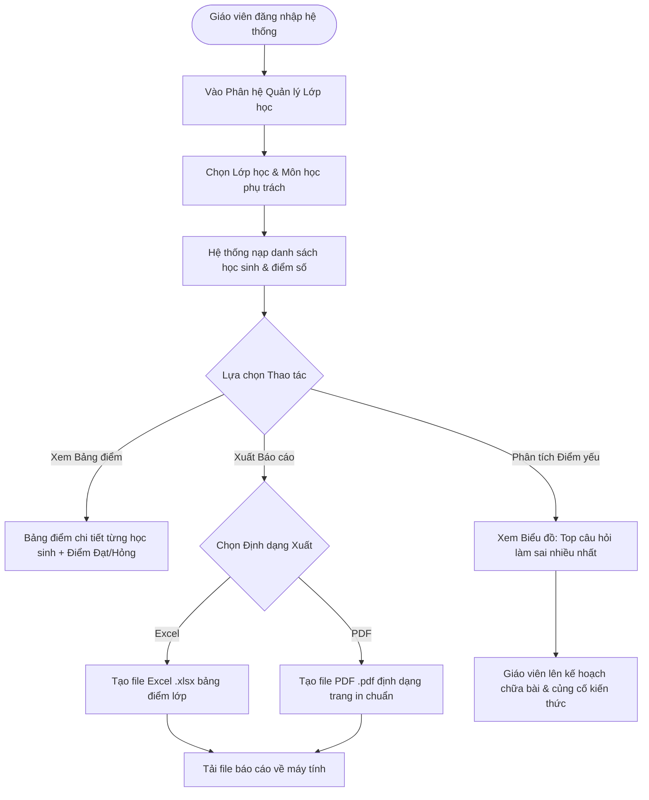

# FLOW 07: Giáo Viên Theo Dõi Điểm Lớp, Phân Tích Câu Sai & Xuất Báo Cáo

**Độ phức tạp:** Khá  
**Tác nhân chính (Actors):** Giáo viên bộ môn (Teacher)  
**Mục tiêu (Purpose):** Quy trình làm việc độc lập của giáo viên: theo dõi tiến độ và bảng điểm của học sinh các lớp mình giảng dạy, xem phân tích các câu hỏi học sinh làm sai nhiều nhất để kịp thời bổ sung kiến thức và tự chủ xuất báo cáo (Excel/PDF).  

---

## 1. Sơ đồ Quy trình (Flowchart)

---

## 2. Mô tả Chi tiết Từng bước (Step-by-Step Execution)

### Bước 1: Đăng nhập và Mở phân hệ Quản lý Lớp
* **Tác nhân thực hiện:** Giáo viên (Truy cập)
* **Mô tả chi tiết:** Giáo viên đăng nhập. Hệ thống tự động xác định phạm vi quyền hạn (chỉ hiển thị các lớp và môn học mà giáo viên này được phân công).
* **Giao diện trực quan (UI View):** Dashboard Giáo viên: Menu danh sách các lớp phụ trách (ví dụ: 'Lớp 10A1 - Môn Hóa', 'Lớp 11B2 - Môn Sinh').

### Bước 2: Xem danh sách và kết quả học sinh theo lớp
* **Tác nhân thực hiện:** Giáo viên (Theo dõi)
* **Mô tả chi tiết:** Giáo viên chọn lớp và môn. Hệ thống nạp bảng điểm chi tiết: Họ tên học sinh, số lần thi, điểm số các bài, trạng thái Đạt (Xanh) hoặc Chưa đạt (Đỏ), xếp loại học lực.
* **Giao diện trực quan (UI View):** Bảng dữ liệu phân trang, có ô tìm kiếm tên học sinh, cột trạng thái Đạt/Không đạt nổi bật.

### Bước 3: Xem biểu đồ phân tích các câu hỏi sai nhiều nhất
* **Tác nhân thực hiện:** Giáo viên & Hệ thống (Phân tích điểm yếu)
* **Mô tả chi tiết:** Hệ thống tự động thống kê tỷ lệ trả lời đúng/sai của cả lớp theo từng câu hỏi. Hiển thị danh sách Top 5 - Top 10 câu hỏi học sinh làm sai nhiều nhất.
* **Giao diện trực quan (UI View):** Biểu đồ cột thể hiện tỷ lệ sai (ví dụ: 'Câu 14: 78% học sinh chọn sai'). Bấm vào xem ngay nội dung câu hỏi và lời giải.

### Bước 4: Xuất file Báo cáo kết quả (Excel & PDF)
* **Tác nhân thực hiện:** Giáo viên (Tự xuất báo cáo)
* **Mô tả chi tiết:** Giáo viên bấm nút 'Xuất Excel' hoặc 'Xuất PDF'. Hệ thống tự động trích xuất bảng tổng hợp kết quả của lớp phụ trách mà không cần làm phiền hay chờ đợi Admin.
* **Giao diện trực quan (UI View):** Nút 'Xuất Excel (.xlsx)' màu xanh lá và 'Xuất PDF (.pdf)' màu đỏ gạch. File tải về máy tính sau 1 giây.

---

## 3. Quy tắc Nghiệp vụ Cần Ghi nhớ (Business Rules)

* Giới hạn quyền hạn: Giáo viên tuyệt đối không thể xem điểm hoặc dữ liệu học sinh của lớp do giáo viên khác phụ trách.
* Giáo viên không có quyền can thiệp vào cấu hình chung của hệ thống (thời gian thi, số câu hỏi của kỳ thi).
* Báo cáo xuất ra chỉ chứa dữ liệu học sinh thuộc lớp giáo viên phụ trách.
