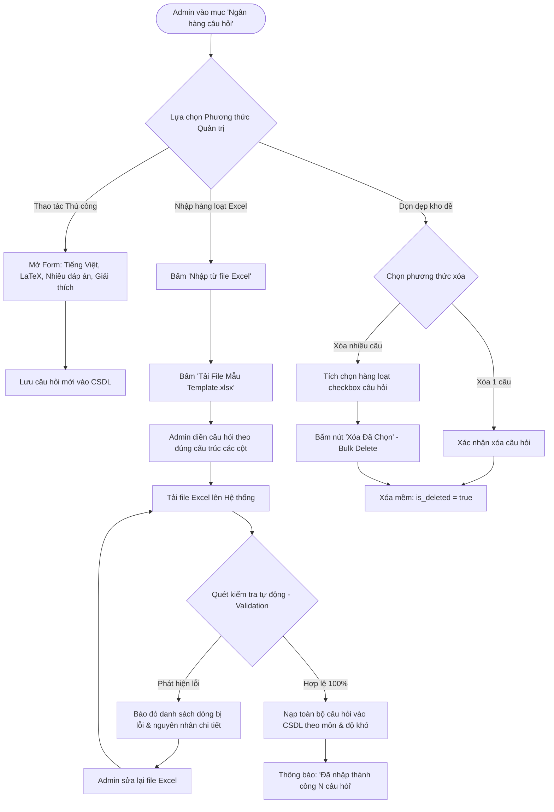

# FLOW 09: Quản Trị Ngân Hàng Câu Hỏi & Nhập Hàng Loạt Từ Excel

**Độ phức tạp:** Phức tạp  
**Tác nhân chính (Actors):** Quản trị viên (Admin)  
**Mục tiêu (Purpose):** Quản lý toàn diện ngân hàng câu hỏi 3 môn thi (Hóa, Sinh, Tiếng Anh). Hỗ trợ nhập thủ công, nhập hàng loạt qua file Excel có kiểm tra lỗi cú pháp/LaTeX, cung cấp file template mẫu chuẩn và xóa câu hỏi linh hoạt (đơn lẻ hoặc hàng loạt).  

---

## 1. Sơ đồ Quy trình (Flowchart)

---

## 2. Mô tả Chi tiết Từng bước (Step-by-Step Execution)

### Bước 1: Truy cập Quản lý Ngân hàng Câu hỏi
* **Tác nhân thực hiện:** Admin (Khởi tạo)
* **Mô tả chi tiết:** Admin mở mục quản lý kho đề. Hệ thống hiển thị bảng danh sách các câu hỏi hiện có, bộ lọc theo môn (Hóa, Sinh, Tiếng Anh), mức độ khó và loại câu hỏi.
* **Giao diện trực quan (UI View):** Bảng quản lý câu hỏi hiện đại, bộ lọc drop-down môn học, nút 'Thêm mới', 'Nhập Excel', 'Tải Template' và 'Xóa đã chọn'.

### Bước 2: Thêm mới hoặc chỉnh sửa câu hỏi thủ công
* **Tác nhân thực hiện:** Admin (Nhập thủ công)
* **Mô tả chi tiết:** Admin bấm 'Thêm câu hỏi'. Nhập nội dung tiếng Việt, công thức LaTeX (kẹp giữa dấu $), chọn loại 1 đáp án hoặc nhiều đáp án, tích chọn phương án đúng và nhập giải thích.
* **Giao diện trực quan (UI View):** Trình soạn thảo có khung xem trước trực tiếp công thức LaTeX và phương trình hóa học.

### Bước 3: Tải file mẫu Excel chuẩn (Download Template)
* **Tác nhân thực hiện:** Admin (Tải Template)
* **Mô tả chi tiết:** Admin bấm nút 'Tải file mẫu'. Hệ thống tải về file `Mau_Import_Cau_Hoi.xlsx` đã thiết lập sẵn các cột kèm sheet hướng dẫn chi tiết.
* **Giao diện trực quan (UI View):** Nút bấm 'Tải file mẫu (.xlsx)' màu xanh dương có icon tải về.

### Bước 4: Upload file Excel và Quét kiểm tra lỗi tự động
* **Tác nhân thực hiện:** Admin & Hệ thống (Import & Validation)
* **Mô tả chi tiết:** Admin chọn file Excel và tải lên. Hệ thống quét tự động từng dòng: nếu có lỗi thì báo rõ số dòng bị sai; nếu chuẩn thì nạp toàn bộ câu hỏi vào CSDL.
* **Giao diện trực quan (UI View):** Bảng hiển thị tiến trình: 'Quét 150 câu hỏi... Thành công 150/150 câu' kèm nút 'Xác nhận Lưu'.

### Bước 5: Xóa đơn lẻ hoặc Xóa hàng loạt bằng cơ chế Xóa mềm (Soft Delete)
* **Tác nhân thực hiện:** Admin (Xóa mềm linh hoạt)
* **Mô tả chi tiết:** Admin có thể bấm icon xóa ở từng dòng, hoặc tích chọn vào ô checkbox ở đầu các dòng rồi bấm nút 'Xóa đã chọn (Bulk Delete)' để dọn dẹp kho đề. Hệ thống áp dụng cơ chế Xóa mềm (`is_deleted = true`), ẩn câu hỏi khỏi ngân hàng đề thi nhưng bảo toàn 100% dữ liệu bài thi cũ của học sinh.
* **Giao diện trực quan (UI View):** Hộp thoại xác nhận: 'Bạn đang chọn xóa N câu hỏi. Hệ thống sẽ áp dụng Xóa mềm (is_deleted = true) để lưu trữ trọn vẹn lịch sử thi của học sinh'.

---

## 3. Quy tắc Nghiệp vụ Cần Ghi nhớ (Business Rules)

* Cột Correct_Answers trong Excel phải khớp với các ký tự phương án (A, B, C, D). Nếu nhiều đáp án đúng thì phân tách bằng dấu phẩy (ví dụ: A,C hoặc B,D).
* Mã LaTeX phải nằm giữa cặp dấu $ để hệ thống nhận diện và hiển thị đúng công thức.
* Xóa hàng loạt (Bulk Delete) yêu cầu hộp thoại xác nhận 2 lớp để tránh Admin bấm nhầm.
* Cơ chế Xóa mềm (`is_deleted = true`): Câu hỏi bị xóa sẽ không xuất hiện trong ngân hàng câu hỏi và các đề thi mới, nhưng toàn bộ lịch sử thi và bài làm trong quá khứ của học sinh được bảo toàn trọn vẹn (kết hợp ràng buộc `ON DELETE RESTRICT` và snapshot nội dung).
