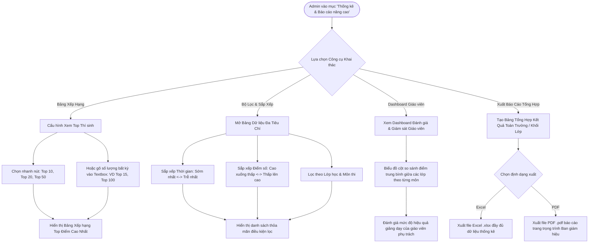

# FLOW 10: Bảng Xếp Hạng Top Điểm, Dashboard Đánh Giá Giáo Viên & Báo Cáo

**Độ phức tạp:** Rất phức tạp  
**Tác nhân chính (Actors):** Quản trị viên (Admin) / Ban giám hiệu  
**Mục tiêu (Purpose):** Khai thác dữ liệu phân tích sau kỳ thi ở cấp độ toàn trường. Cung cấp bảng xếp hạng thí sinh linh hoạt (Top 10/20/50 hoặc gõ số tùy biến), bộ lọc đa tiêu chí (thời gian làm bài nhanh/chậm, điểm số cao/thấp), dashboard so sánh các lớp theo môn học để đánh giá giáo viên và xuất báo cáo tổng hợp (Excel/PDF).  

---

## 1. Sơ đồ Quy trình (Flowchart)

---

## 2. Mô tả Chi tiết Từng bước (Step-by-Step Execution)

### Bước 1: Mở Trung tâm Thống kê & Báo cáo
* **Tác nhân thực hiện:** Admin (Truy cập)
* **Mô tả chi tiết:** Admin truy cập phân hệ Báo cáo. Màn hình chia thành các khu vực: Thống kê nhanh, Bảng xếp hạng Top điểm, Bộ lọc tìm kiếm và Dashboard đánh giá chất lượng giảng dạy.
* **Giao diện trực quan (UI View):** Giao diện Dashboard hiện đại với 4 thẻ tóm tắt (Tổng thí sinh đã thi, Điểm trung bình, Tỷ lệ Đạt, Lớp dẫn đầu).

### Bước 2: Xem Bảng Xếp hạng Top điểm cao
* **Tác nhân thực hiện:** Admin (Xếp hạng)
* **Mô tả chi tiết:** Admin bấm nhanh các nút 'Top 10', 'Top 20', 'Top 50', hoặc gõ một số bất kỳ vào ô Textbox (ví dụ: gõ số '15' để xem Top 15, gõ '100' để xem Top 100) -> Hệ thống trích xuất danh sách dẫn đầu kỳ thi.
* **Giao diện trực quan (UI View):** Hàng nút bấm: [Top 10] [Top 20] [Top 50] + Ô nhập liệu 'Nhập số Top...' [Xem]. Huy chương Vàng, Bạc, Đồng ở Top 3.

### Bước 3: Áp dụng Bộ lọc & Sắp xếp đa tiêu chí
* **Tác nhân thực hiện:** Admin (Bộ lọc đa chiều)
* **Mô tả chi tiết:** Admin sử dụng bộ lọc nâng cao: Sắp xếp theo Thời gian hoàn thành (Sớm nhất / Trễ nhất), sắp xếp theo Điểm số (Từ cao xuống thấp hoặc ngược lại), lọc theo Lớp, theo Môn học.
* **Giao diện trực quan (UI View):** Thanh công cụ lọc đa năng: dropdown Môn, dropdown Lớp, toggle sắp xếp Thời gian, toggle sắp xếp Điểm.

### Bước 4: Dashboard So sánh các Lớp & Đánh giá Giáo viên
* **Tác nhân thực hiện:** Admin & Ban Giám Hiệu (Giám sát & Đánh giá)
* **Mô tả chi tiết:** Dashboard hiển thị biểu đồ trực quan so sánh điểm trung bình giữa các lớp theo từng môn học. Ban giám hiệu căn cứ vào đây để đánh giá hiệu quả giảng dạy của giáo viên phụ trách.
* **Giao diện trực quan (UI View):** Biểu đồ cột so sánh điểm trung bình các lớp theo môn. Bảng xếp hạng chất lượng giảng dạy của giáo viên.

### Bước 5: Xuất Báo cáo Tổng hợp (Excel & PDF)
* **Tác nhân thực hiện:** Admin (Xuất báo cáo)
* **Mô tả chi tiết:** Admin tổng hợp kết quả của một lớp, nhiều lớp hoặc toàn bộ trường. Bấm nút 'Xuất Excel' để nhận bảng tính chi tiết hoặc 'Xuất PDF' để in ấn nộp Ban giám hiệu.
* **Giao diện trực quan (UI View):** Nút bấm 'Tải Báo cáo Tổng Hợp Excel' và 'Xuất Báo Cáo PDF Trình Ký'. File xuất có đầy đủ chữ ký, biểu đồ và phân tích.

---

## 3. Quy tắc Nghiệp vụ Cần Ghi nhớ (Business Rules)

* Bảo mật cấp cao: Chỉ tài khoản Quản trị viên (Admin) và Ban giám hiệu mới có quyền truy cập Dashboard đánh giá giáo viên.
* Ô Textbox nhập số lượng Top phải có cơ chế kiểm tra (Validate): Chỉ cho phép nhập số nguyên dương hợp lệ.
* Báo cáo xuất ra phải chuẩn hóa theo quy cách văn bản sư phạm, có đầy đủ ngày giờ lập và tên người xuất báo cáo.
