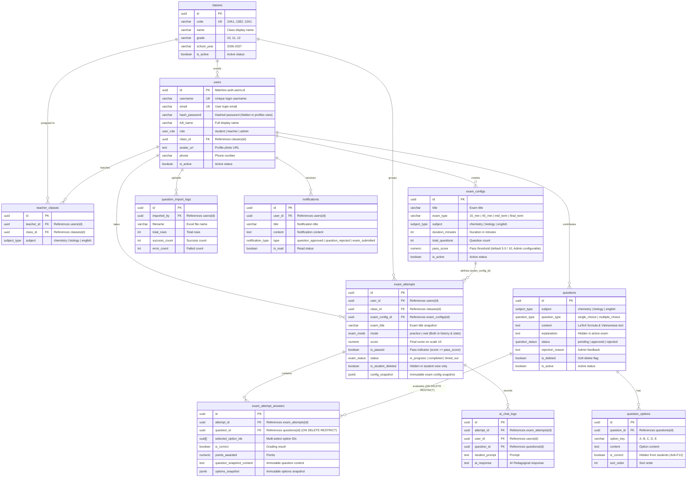

# THIẾT KẾ CƠ SỞ DỮ LIỆU SUPABASE CHO EXAM APP (SELF-HOSTED DOCKER)

> **Căn cứ tài liệu:** [Supabase Self-Hosting with Docker Guide](https://supabase.com/docs/guides/self-hosting/docker)  
> **Phiên bản:** 2.4 (Kiến trúc Bảo mật Chuẩn: Khóa 100% quyền INSERT/UPDATE trực tiếp của học sinh trên `exam_attempts` & `exam_attempt_answers`, vận hành toàn diện qua 3 RPC bảo mật `SECURITY DEFINER`, đóng triệt để 4 lỗ hổng H1, H2, H3, H4; bổ sung `fn_save_answer` và `fn_delete_student_attempt`; 11 bảng, 3 views, 17 functions)  
> **Phạm vi nghiệp vụ:** Toàn bộ 10 Flows (Đăng ký/Đăng nhập, Thi thử AI Chatbot, Thi thật tự nộp bài, Xóa mềm, Cấu hình đề thi, Phân lớp học sinh, Giáo viên quản lý lớp, Đóng góp & Phê duyệt câu hỏi, Import Excel, Dashboard & Bảng xếp hạng).

---

## 1. KIẾN TRÚC TỔNG THỂ DOCKER (SUPABASE STACK)

Theo chuẩn tài liệu chính thức mới nhất của Supabase, hệ thống được đóng gói thành một cụm Docker Compose thống nhất gồm các dịch vụ độc lập:

```
                            [ Trình duyệt / Client (Next.js) ]
                                            │
                                  Port 8000 (HTTP)
                                            ▼
                    ┌───────────────────────────────────────────────┐
                    │          API Gateway (Envoy Proxy)            │
                    └───────┬───────────┬───────────┬───────────┬───┘
                            │           │           │           │
            ┌───────────────┘           │           │           └────────────────┐
            ▼                           ▼           ▼                            ▼
┌───────────────────────┐   ┌─────────────────┐   ┌────────────────────┐   ┌───────────────────────┐
│ Supabase Studio (UI)  │   │  Auth (GoTrue)  │   │ PostgREST (REST)   │   │  Realtime (Websocket) │
│ Dashboard quản trị    │   │  Đăng nhập/JWT  │   │  CRUD tự động RLS  │   │   Phát sóng sự kiện   │
└───────────┬───────────┘   └────────┬────────┘   └─────────┬──────────┘   └───────────┬───────────┘
            │                        │                      │                          │
            └────────────────────────┼──────────────────────┼──────────────────────────┘
                                     ▼                      ▼
                            ┌───────────────────────────────────────────┐
                            │    Connection Pooler (Supavisor/Direct)   │
                            └─────────────────────┬─────────────────────┘
                                                  ▼
                                    ┌───────────────────────────┐
                                    │  PostgreSQL 17 Container  │
                                    │  (Schema, Triggers, RLS)  │
                                    └───────────────────────────┘
```

- **PostgreSQL 17 (`supabase-db`)**: Cơ sở dữ liệu hạt nhân, chứa toàn bộ schema 11 bảng, 3 views, 17 stored procedures & triggers, và chính sách bảo mật hàng (Row Level Security - RLS).
- **Envoy Gateway (`api-gw`)**: Tiếp nhận toàn bộ traffic tại port `8000`, định tuyến đến Studio, REST API, Auth, Realtime và Storage.
- **GoTrue (`auth`)**: Quản lý tài khoản thí sinh, giáo viên, admin qua Email/Password và Google OAuth 2.0.
- **PostgREST (`rest`)**: Tự động sinh RESTful API từ schema PostgreSQL với bảo vệ RLS.
- **Supabase Studio (`studio`)**: Giao diện trực quan xem bảng dữ liệu, chạy SQL Editor, quản lý người dùng và cấu hình API.

---

## 2. SƠ ĐỒ THỰC THỂ LIÊN KẾT (MERMAID ERD)



---

## 3. DANH MỤC 3 VIEWS VÀ 17 FUNCTIONS HỆ THỐNG

### 3.1. Danh mục 3 Views
1. **`public.profiles`**: View bảo mật bọc trên bảng vật lý `users` (`WITH (security_invoker = true)`), loại bỏ `hash_password` để bảo vệ an toàn cho frontend.
2. **`public.view_leaderboard`**: Bảng xếp hạng vinh danh **THEO HỌC SINH** (`user_id`). Mỗi học sinh chỉ xuất hiện đúng 1 lần với kết quả xuất sắc nhất (Điểm cao nhất $\to$ Thời gian nhanh nhất). Tính cả bài `completed` và `timed_out`, hỗ trợ phân nhóm theo chế độ (`mode`).
3. **`public.view_class_performance`**: Thống kê kết quả theo Lớp và Môn học. **Bao gồm cả Thi Thật (`real`) và Thi Thử (`practice`)** với đầy đủ các chỉ số: tổng lượt thi, số học sinh duy nhất tham gia, điểm TB, cao nhất, thấp nhất và tỷ lệ đạt.

### 3.2. Danh mục 17 Functions
1. `handle_updated_at()`: Tự động cập nhật `updated_at = now()`.
2. `handle_new_user()`: Cưỡng chế `role = 'student'` khi đăng ký mới (chống tự phong Admin).
3. `trg_fn_protect_exam_attempt()`: Khóa cứng `total_questions`, `pass_score`, `duration_minutes` và trạng thái (phòng tuyến số 2 Defense in Depth).
4. `fn_handle_question_teacher_resubmit()`: Tự động chuyển câu hỏi bị từ chối sang `pending` khi giáo viên sửa lại để Admin duyệt.
5. `fn_notify_question_review()`: Tự động tạo thông báo gửi giáo viên khi Admin duyệt hoặc từ chối câu hỏi.
6. `fn_get_academic_rank(p_score)`: Hàm quy đổi điểm sang xếp loại học lực Thang 10 (Xuất sắc, Giỏi, Khá, Trung bình, Yếu).
7. `fn_start_exam(p_exam_config_id, p_mode)`: RPC khởi tạo lượt thi và tự động bốc ngẫu nhiên $N$ câu hỏi từ ngân hàng nạp sẵn vào `exam_attempt_answers` kèm snapshot, triệt tiêu lỗi 0 câu hỏi (Đóng H2, H3).
8. `fn_save_answer(p_attempt_id, p_question_id, p_selected_option_ids)`: RPC lưu câu trả lời từng câu và kiểm tra thời gian thực tại server; nếu quá thời gian tự động khóa bài thi và từ chối lưu đáp án (Đóng H4).
9. `fn_submit_exam_attempt(p_attempt_id, p_answers, p_auto_submitted)`: Stored procedure nộp bài và chấm điểm chuẩn xác, hỗ trợ đầy đủ 3 tham số, chia điểm theo số câu authoritative từ `exam_configs`, cập nhật kết quả và thông báo giáo viên (Đóng H1, H2).
10. `fn_delete_student_attempt(p_attempt_id)`: RPC xóa mềm cá nhân phía học sinh (`is_student_deleted = true`), giúp học sinh không cần bất kỳ quyền direct UPDATE nào trên bảng vật lý.
11. `fn_get_exam_questions(p_attempt_id)`: RPC lấy đề thi an toàn, ẩn triệt để `is_correct` và `explanation` để chống gian lận F12 (hỗ trợ tự phục hồi nạp câu hỏi).
12. `fn_get_attempt_review(p_attempt_id)`: RPC trả về đáp án và lời giải thích sau khi bài thi hoàn thành, kiểm tra bảo mật nghiêm ngặt chỉ chính chủ (`user_id = auth.uid()`) hoặc GV phụ trách/Admin (Vá Warning 1).
13. `get_user_role()`: Helper kiểm tra vai trò hiện tại của người dùng.
14. `is_admin()`: Helper kiểm tra người dùng có quyền Admin.
15. `is_teacher()`: Helper kiểm tra người dùng có quyền Giáo viên.
16. `is_teacher_of_class_and_subject(...)`: Helper kiểm tra giáo viên có phụ trách đúng lớp và môn học chỉ định.
17. `is_teacher_of_subject(...)`: Helper kiểm tra giáo viên có phụ trách môn học chỉ định (khi đóng góp câu hỏi).

---

## 4. BẢN VÁ BẢO MẬT & QUY TẮC TOÀN VẸN DỮ LIỆU ĐÃ ĐỒNG BỘ

0. **Đột phá Kiến trúc Bảo mật: Khóa 100% Ghi trực tiếp & Đóng đồng thời 4 Lỗ hổng H1, H2, H3, H4:**
   - Khóa toàn bộ quyền `INSERT/UPDATE` trực tiếp của học sinh trên cả 2 bảng `exam_attempts` và `exam_attempt_answers`.
   - Vận hành 100% qua 3 RPC cốt lõi (`fn_start_exam`, `fn_save_answer`, `fn_submit_exam_attempt`) cùng `fn_delete_student_attempt`.
   - **H1 (Chống tự sửa điểm/hack điểm 10):** RLS chặn đứng lệnh API gửi đến `exam_attempts`.
   - **H2 (Chống can thiệp số câu/điểm đạt):** Đọc cấu hình authoritative trực tiếp từ `exam_configs`.
   - **H3 (Chống lộ đáp án F12):** Khóa quyền SELECT trên `question_options.is_correct` và giấu cột trong payload RPC.
   - **H4 (Chống gian lận lưu đáp án sau giờ thi):** `fn_save_answer` kiểm tra thời gian thực tế tại PostgreSQL server, từ chối lưu và khóa bài nếu quá giờ.
1. **Khắc phục Warning 1 (Bảo mật riêng tư bài thi trong `fn_get_attempt_review`):** Bổ sung kiểm tra bắt buộc `v_attempt.user_id = auth.uid()` OR `public.is_admin()` OR `(public.is_teacher() AND public.is_teacher_of_class_and_subject(v_attempt.class_id, v_attempt.subject))`.
2. **Khắc phục Warning 2 (Lỗi trả về 0 câu hỏi khi thi):** Bổ sung RPC `fn_start_exam` bốc câu hỏi tự động và cơ chế tự phục hồi trong `fn_get_exam_questions`.
3. **Khắc phục Warning 3 (Chống hack điểm bằng can thiệp tham số đề thi):** Chia điểm theo số câu chuẩn authoritative từ `exam_configs`.
4. **Khắc phục Warning 4 (Đồng bộ tham số hàm nộp bài `fn_submit_exam_attempt`):** Khai báo hỗ trợ 3 tham số `(p_attempt_id, p_answers, p_auto_submitted)`.
5. **Khắc phục Warning 5 (Chống học sinh tự ý nhảy lớp `class_id`):** Policy `users_update_own` bổ sung kiểm tra bất biến `class_id`.
6. **Khắc phục Warning 6 (Ẩn câu hỏi đã xóa mềm với Giáo viên):** Policy `questions_select` ở nhánh Giáo viên bổ sung `is_deleted = false`.
7. **Khắc phục Warning 7 (Chuẩn hóa câu chữ Flow 09 và Flow 02):** Flow 09 chuẩn hóa `is_deleted = true`. Flow 02 chuẩn hóa `is_student_deleted = true`.
8. **Khắc phục Warning 8 (Xóa file migration seed trùng lặp):** Đã xóa file `20260930000002_exam_app_seed.sql`, giữ lại file `20260930000002_seed_data.sql`.
9. **Chống tự nâng quyền:** Trigger `handle_new_user()` luôn gán `role = 'student'` khi đăng ký.
10. **Chống F12 / API đọc trước đáp án:** Ẩn hoàn toàn `is_correct` đối với học sinh.
11. **Bảo mật View:** View `profiles` kế thừa RLS từ `users` và ẩn `hash_password`.
12. **Bảo toàn bài hết giờ:** View xếp hạng và thống kê lớp tính cả `status = 'timed_out'`.
13. **Bảo toàn điểm số khi học sinh xóa mềm:** Sử dụng cờ `is_student_deleted`.
14. **Bảo toàn lịch sử câu hỏi bằng xóa mềm:** `questions.is_deleted = true`, kết hợp `ON DELETE RESTRICT`.
15. **Chấm điểm chuẩn xác theo thang điểm 10:** Điểm = (Số câu đúng / Tổng số câu đề thi) × 10.
16. **Xếp hạng theo học sinh:** Bảng xếp hạng thi đua nhóm theo từng học sinh, lấy lượt thi tốt nhất.
17. **Thi thử được tính vào lịch sử & thống kê:** Cả `real` và `practice` đều đưa vào thống kê.

---

## 5. MA TRẬN PHÂN QUYỀN VÀ ROW LEVEL SECURITY (RLS) ĐẦY ĐỦ 11 BẢNG

| Bảng | Thí sinh (Student) | Giáo viên bộ môn (Teacher) | Quản trị viên (Admin) |
| :--- | :--- | :--- | :--- |
| `classes` | **SELECT**: Chỉ xem các lớp đang hoạt động (`is_active = true`) để chọn khi đăng ký. | **SELECT**: Xem danh sách lớp học. | **ALL (CRUD)**: Toàn quyền tạo, sửa, xóa, phân lớp. |
| `users` | **SELECT / UPDATE**: Xem và sửa thông tin cá nhân của mình (`id = auth.uid()`). Không thể tự đổi `role` và không thể tự đổi `class_id` (chỉ Admin phân lớp - Fix Warning 5). | **SELECT**: Xem hồ sơ của mình và học sinh thuộc các lớp mình phụ trách. | **ALL (CRUD)**: Toàn quyền xem và cập nhật phân quyền mọi user. |
| `teacher_classes` | **Không có quyền truy cập**. | **SELECT**: Xem phân công giảng dạy của mình. | **ALL (CRUD)**: Toàn quyền phân công giáo viên vào lớp theo môn. |
| `exam_configs` | **SELECT**: Xem các đề thi đang mở hoạt động (`is_active = true`). | **SELECT**: Xem cấu hình các đề thi. | **ALL (CRUD)**: Toàn quyền cấu hình (số câu, thời gian, điểm đạt, loại kỳ thi). |
| `questions` | **SELECT**: Chỉ đọc các câu hỏi đã duyệt (`approved`), hoạt động và chưa bị xóa mềm trong bài thi. | **SELECT / INSERT / UPDATE**: Xem câu đã duyệt (chưa xóa mềm: `is_deleted = false` - Fix Warning 6) + câu mình đề xuất (`pending`, `rejected`). Đề xuất câu mới thuộc môn mình dạy. Sửa câu bị rejected để nộp lại. | **ALL (CRUD)**: Toàn quyền duyệt, từ chối kèm lý do, sửa và xóa mềm câu hỏi (`is_deleted = true`). |
| `question_options` | **Không SELECT trực tiếp (Chống F12)**; chỉ nhận dữ liệu qua RPC `fn_get_exam_questions` (đã giấu `is_correct`). | **SELECT / ALL**: Xem đáp án câu hỏi của môn mình dạy hoặc do mình đóng góp. | **ALL (CRUD)**: Toàn quyền quản trị đáp án. |
| `exam_attempts` | **KHÓA 100% INSERT/UPDATE TRỰC TIẾP**. Chỉ **SELECT** bài của mình (`is_student_deleted = false`). Thao tác 100% qua các RPC bảo mật: `fn_start_exam`, `fn_save_answer`, `fn_submit_exam_attempt`, `fn_delete_student_attempt` (Đóng H1, H2). | **SELECT**: Xem toàn bộ kết quả của học sinh lớp mình dạy theo đúng môn (kể cả bài học sinh đã xóa cá nhân). | **ALL (CRUD)**: Toàn quyền xem toàn bộ hệ thống để lập báo cáo, xếp hạng. |
| `exam_attempt_answers` | **KHÓA 100% INSERT/UPDATE TRỰC TIẾP**. Chỉ **SELECT** sau khi nộp bài hoặc thi thử. Thao tác lưu đáp án 100% qua RPC `fn_save_answer` (Đóng H4). Đề thi nhận qua `fn_start_exam` (Đóng H3). | **SELECT**: Xem bài làm chi tiết của học sinh lớp mình dạy theo đúng môn. | **ALL (CRUD)**: Toàn quyền tra cứu chi tiết bài làm phục vụ hậu kiểm. |
| `notifications` | **ALL**: Nhận và đọc thông báo cá nhân (`user_id = auth.uid()`). | **ALL**: Nhận thông báo duyệt câu hỏi, bài thi mới nộp. | **ALL (CRUD)**: Toàn quyền quản trị thông báo. |
| `ai_chat_logs` | **SELECT / INSERT**: Xem và tạo nhật ký hỏi đáp AI của bài thi mình. | **SELECT**: Xem nhật ký AI của học sinh lớp mình. | **ALL (CRUD)**: Toàn quyền quản trị nhật ký AI. |
| `question_import_logs` | **Không có quyền truy cập**. | **SELECT / INSERT**: Xem lịch sử import Excel câu hỏi do mình thực hiện. | **ALL (CRUD)**: Toàn quyền theo dõi mọi phiên import câu hỏi. |

