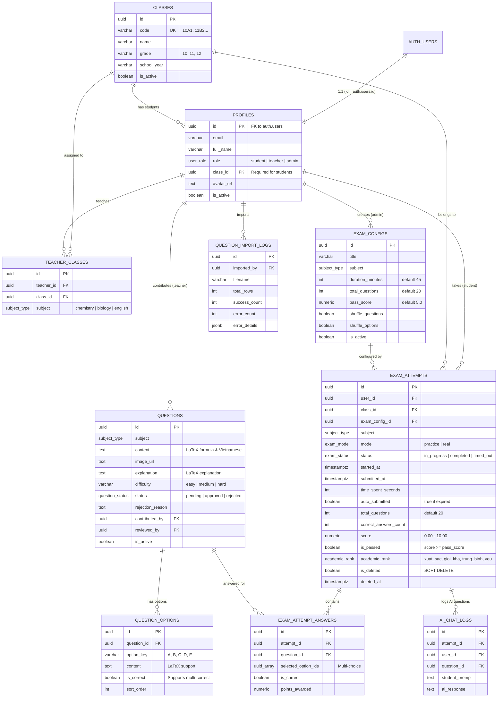

# THIẾT KẾ CƠ SỞ DỮ LIỆU SUPABASE CHO EXAM APP (SELF-HOSTED DOCKER)

> **Căn cứ tài liệu:** [Supabase Self-Hosting with Docker Guide](https://supabase.com/docs/guides/self-hosting/docker)  
> **Phạm vi nghiệp vụ:** Toàn bộ 10 Flows (Đăng ký/Đăng nhập, Thi thử AI Chatbot, Thi thật tự nộp bài, Xóa mềm, Cấu hình đề thi, Phân lớp học sinh, Giáo viên quản lý lớp, Đóng góp & Phê duyệt câu hỏi, Import Excel, Dashboard & Bảng xếp hạng).

---

## 1. KIẾN TRÚC TỔNG THỂ DOCKER (SUPABASE STACK)

Theo chuẩn tài liệu chính thức mới nhất của Supabase, hệ thống được đóng gói thành một cụm Docker Compose thống nhất gồm các dịch vụ độc lập:

```
                            [ Trình duyệt / Client (Next.js) ]
                                            │
                                  Port 8000 (HTTP)
                                            ▼
                    ┌───────────────────────────────────────────────┐
                    │          API Gateway (Envoy Proxy)            │
                    └───────┬───────────┬───────────┬───────────┬───┘
                            │           │           │           │
            ┌───────────────┘           │           │           └────────────────┐
            ▼                           ▼           ▼                            ▼
┌───────────────────────┐   ┌─────────────────┐   ┌────────────────────┐   ┌───────────────────────┐
│ Supabase Studio (UI)  │   │  Auth (GoTrue)  │   │ PostgREST (REST)   │   │  Realtime (Websocket) │
│ Dashboard quản trị    │   │  Đăng nhập/JWT  │   │  CRUD tự động RLS  │   │   Phát sóng sự kiện   │
└───────────┬───────────┘   └────────┬────────┘   └─────────┬──────────┘   └───────────┬───────────┘
            │                        │                      │                          │
            └────────────────────────┼──────────────────────┼──────────────────────────┘
                                     ▼                      ▼
                            ┌───────────────────────────────────────────┐
                            │    Connection Pooler (Supavisor/Direct)   │
                            └─────────────────────┬─────────────────────┘
                                                  ▼
                                    ┌───────────────────────────┐
                                    │  PostgreSQL 17 Container  │
                                    │  (Schema, Triggers, RLS)  │
                                    └───────────────────────────┘
```

- **PostgreSQL 17 (`supabase-db`)**: Cơ sở dữ liệu hạt nhân, chứa toàn bộ schema, triggers, views, stored procedures và chính sách bảo mật hàng (Row Level Security - RLS).
- **Envoy Gateway (`api-gw`)**: Tiếp nhận toàn bộ traffic tại port `8000`, định tuyến đến Studio, REST API, Auth, Realtime và Storage.
- **GoTrue (`auth`)**: Quản lý tài khoản thí sinh, giáo viên, admin qua Email/Password và Google OAuth 1-touch.
- **PostgREST (`rest`)**: Tự động sinh RESTful API từ schema PostgreSQL với bảo vệ RLS.
- **Supabase Studio (`studio`)**: Giao diện trực quan xem bảng dữ liệu, chạy SQL Editor, quản lý người dùng và cấu hình API.

---

## 2. SƠ ĐỒ THỰC THỂ LIÊN KẾT (MERMAID ERD)



---

## 3. TỪ ĐIỂN DỮ LIỆU CHI TIẾT (DATA DICTIONARY)

### 3.1. Các kiểu dữ liệu tùy chỉnh (Custom ENUMs)
- **`user_role`**: `'student'` (Thí sinh), `'teacher'` (Giáo viên bộ môn), `'admin'` (Quản trị viên).
- **`subject_type`**: `'chemistry'` (Hóa học), `'biology'` (Sinh học), `'english'` (Tiếng Anh).
- **`exam_mode`**: `'practice'` (Thi thử - xem đáp án & hỏi AI ngay), `'real'` (Thi thật - bấm giờ & tự động nộp bài).
- **`exam_status`**: `'in_progress'` (Đang làm), `'completed'` (Đã nộp), `'timed_out'` (Hết giờ tự nộp), `'cancelled'`.
- **`question_status`**: `'pending'` (Chờ duyệt - GV đề xuất), `'approved'` (Đã duyệt), `'rejected'` (Từ chối).
- **`academic_rank`**: Xếp loại học lực chuẩn:
  - `xuat_sac`: $\ge 9.0$
  - `gioi`: $8.0 \le \text{Điểm} < 9.0$
  - `kha`: $6.5 \le \text{Điểm} < 8.0$
  - `trung_binh`: $5.0 \le \text{Điểm} < 6.5$
  - `yeu`: $< 5.0$

---

### 3.2. Bảng `classes` (Quản lý Lớp học - Flow 06)
| Cột | Kiểu | Ràng buộc | Mô tả |
| :--- | :--- | :--- | :--- |
| `id` | `UUID` | PK, Default `gen_random_uuid()` | Định danh duy nhất của lớp |
| `code` | `VARCHAR(50)` | UNIQUE, NOT NULL | Mã lớp (VD: `10A1`, `11B2`, `12A1`) |
| `name` | `VARCHAR(100)` | NOT NULL | Tên hiển thị đầy đủ của lớp |
| `grade` | `VARCHAR(20)` | NOT NULL | Khối (`10`, `11`, `12`) |
| `school_year` | `VARCHAR(20)` | DEFAULT `'2026-2027'` | Niên khóa học |
| `is_active` | `BOOLEAN` | DEFAULT `true` | Trạng thái hoạt động |
| `created_at`, `updated_at` | `TIMESTAMPTZ` | DEFAULT `now()` | Thời gian tạo và cập nhật |

---

### 3.3. Bảng `users` (Hồ sơ người dùng - Flow 01)
Được tự động kích hoạt bởi Trigger `on_auth_user_created` khi có user mới đăng ký tại `auth.users` (hoặc quản trị viên thêm trực tiếp):
| Cột | Kiểu | Ràng buộc | Mô tả |
| :--- | :--- | :--- | :--- |
| `id` | `UUID` | PK, FK `auth.users(id)` ON DELETE CASCADE | Khóa chính khớp 1:1 với tài khoản Auth |
| `username` | `VARCHAR(100)` | UNIQUE, Nullable | Tên tài khoản định danh (nếu đăng nhập bằng username/password) |
| `hash_password` | `VARCHAR(255)` | Nullable | Mật khẩu băm (bcrypt/argon2 nếu quản lý auth tùy biến ngoài GoTrue) |
| `email` | `VARCHAR(255)` | NOT NULL | Email đăng nhập |
| `full_name` | `VARCHAR(255)` | NOT NULL | Họ và tên người dùng |
| `role` | `user_role` | DEFAULT `'student'` | Phân quyền: Thí sinh, Giáo viên hoặc Admin |
| `class_id` | `UUID` | FK `classes(id)` | Lớp học trực thuộc (bắt buộc với học sinh) |
| `avatar_url` | `TEXT` | Nullable | Ảnh đại diện |
| `phone` | `VARCHAR(50)` | Nullable | Số điện thoại liên hệ |
| `is_active` | `BOOLEAN` | DEFAULT `true` | Trạng thái tài khoản |

> **Lưu ý tương thích:** Hệ thống đồng thời cung cấp view `public.profiles` trỏ trực tiếp sang `public.users` để giữ tính tương thích ngược với các template Supabase mặc định.

---

### 3.4. Bảng `questions` & `question_options` (Ngân hàng câu hỏi - Flow 08 & 09)
- **Hỗ trợ công thức Toán, Lý, Hóa (LaTeX):** Cột `content` và `explanation` lưu chuỗi LaTeX chuẩn (ví dụ: `\ce{Fe + 2HCl -> FeCl2 + H2 ^}`, `$\frac{a}{b}$`).
- **Hỗ trợ nhiều đáp án đúng:** Cột `is_correct` trên từng option cho phép câu hỏi có 1 hoặc nhiều đáp án đúng (dạng checkbox).
- **Quy trình kiểm duyệt:** Giáo viên đóng góp câu hỏi có `status = 'pending'`. Admin kiểm duyệt chuyển sang `status = 'approved'` hoặc `rejected` kèm lý do `rejection_reason`.

---

### 3.5. Bảng `exam_attempts` & `exam_attempt_answers` (Lượt thi & Xóa mềm - Flow 02, 03, 04)
- **Cơ chế Xóa mềm (Soft Delete):** Cột `is_deleted = true` và `deleted_at = now()`.
  - Học viên **chỉ nhìn thấy và chỉ được xóa bài thi của chính mình**.
  - Không xóa cứng dữ liệu để Admin có thể phục hồi hoặc kiểm toán khi cần.
- **Tính điểm tự động trên thang điểm 10:**
  $$\text{Điểm} = \text{ROUND}\left( \frac{\text{Số câu đúng}}{\text{Tổng số câu}} \times 10, 2 \right)$$
- **Tự động nộp bài khi hết giờ:** Cột `auto_submitted = true` và `status = 'timed_out'`.
- **Chỉ báo trực quan Đạt / Không đạt:** Cột `is_passed = (score >= pass_score)` (Giao diện xanh nếu đạt, đỏ nếu không đạt).

---

### 3.6. Bảng `ai_chat_logs` (Nhật ký Chatbot AI - Flow 03)
Lưu lại lịch sử đối thoại khi thí sinh thi thử và hỏi Chatbot AI giải thích nguyên nhân đáp án đúng/sai:
- `attempt_id`: Lượt thi tương ứng.
- `question_id`: Câu hỏi đang thắc mắc.
- `student_prompt`: Câu hỏi của thí sinh gửi cho AI.
- `ai_response`: Lời giải thích sư phạm từ AI.

---

## 4. MA TRẬN PHÂN QUYỀN VÀ ROW LEVEL SECURITY (RLS)

| Bảng | Thí sinh (Student) | Giáo viên bộ môn (Teacher) | Quản trị viên (Admin) |
| :--- | :--- | :--- | :--- |
| `classes` | Chỉ xem danh sách lớp đang hoạt động để chọn khi đăng ký. | Xem danh sách lớp. | Toàn quyền CRUD (Tạo, sửa, xóa, phân lớp). |
| `users` | Xem và sửa thông tin cá nhân của chính mình. | Xem hồ sơ học sinh thuộc các lớp mình phụ trách. | Toàn quyền xem và cập nhật phân quyền mọi user. |
| `teacher_classes` | Không có quyền truy cập. | Xem phân công giảng dạy của mình. | Toàn quyền phân công giáo viên vào lớp. |
| `exam_configs` | Xem các đề thi đang mở. | Xem cấu hình đề thi. | Toàn quyền cấu hình (số câu, thời gian, điểm đạt). |
| `questions` | Chỉ đọc các câu hỏi đã duyệt (`approved`) trong bài thi. | Xem câu hỏi đã duyệt + các câu do mình đóng góp (`pending`). Đóng góp câu mới. | Toàn quyền CRUD, phê duyệt / từ chối câu hỏi pending. |
| `exam_attempts` | **Chỉ xem và xóa mềm bài của mình (`user_id = auth.uid()`, `is_deleted = false`)**. Tuyệt đối không xem được bài bạn khác. | Xem kết quả của học sinh thuộc các lớp mình phụ trách để chấm và xuất báo cáo. | Xem toàn bộ bài thi hệ thống (kể cả bài xóa mềm) để lập báo cáo, xếp hạng. |
| `ai_chat_logs` | Xem và tạo nhật ký hỏi đáp AI của bài thi mình. | Xem nhật ký AI của học sinh lớp mình. | Toàn quyền quản trị. |

---

## 5. HÀM STORED PROCEDURES VÀ VIEWS HỖ TRỢ NGHIỆP VỤ

1. **`fn_submit_exam_attempt(p_attempt_id, p_auto_submitted)`**:
   - Tự động đối chiếu mảng đáp án chọn `selected_option_ids` với đáp án đúng trong `question_options`.
   - Tính toán số câu đúng, quy đổi sang thang điểm 10 chuẩn.
   - Gán `academic_rank` (Xuất sắc, Giỏi, Khá, Trung bình, Yếu).
   - Đánh dấu trạng thái `completed` hoặc `timed_out`.
2. **`fn_soft_delete_attempt(p_attempt_id)`**:
   - Kiểm tra quyền sở hữu (`user_id = auth.uid()`), thực hiện cập nhật `is_deleted = true`.
3. **`view_leaderboard`**:
   - Phục vụ xếp hạng Top 10/20/50 theo điểm số cao nhất và thời gian hoàn thành sớm nhất.
4. **`view_class_performance`**:
   - Tổng hợp điểm trung bình, điểm cao nhất, tỷ lệ đạt (%) theo từng lớp và môn học để đánh giá giáo viên.
5. **`rpc_get_top_students(subject, class_id, limit, sort_by)`**:
   - API gọi từ Frontend Next.js với các bộ lọc động linh hoạt.

---

## 6. HƯỚNG DẪN KHỞI CHẠY VỚI DOCKER

### Bước 1: Khởi động cụm dịch vụ Supabase
Tại thư mục `exam-app/supabase`:
```bash
docker compose up -d
```

### Bước 2: Kiểm tra trạng thái các container
```bash
docker compose ps
```
Tất cả các container (`supabase-db`, `supabase-rest`, `supabase-auth`, `supabase-studio`, `api-gw`...) sẽ chuyển sang trạng thái `Up (healthy)`.

### Bước 3: Truy cập Supabase Studio (Dashboard)
- **URL Dashboard:** `http://localhost:8000` (hoặc `http://<IP_VPS>:8000`)
- **Username:** `supabase` (mặc định)
- **Password:** Xem tại biến `DASHBOARD_PASSWORD` trong file `.env`.

### Bước 4: Kết nối từ ứng dụng Frontend Next.js
Cài đặt thư viện:
```bash
pnpm add @supabase/supabase-js
```
Cấu hình `.env.local` trong `exam-app/frontend`:
```env
NEXT_PUBLIC_SUPABASE_URL=http://localhost:8000
NEXT_PUBLIC_SUPABASE_ANON_KEY=<SUPABASE_PUBLISHABLE_KEY trong file .env của supabase>
```
Khởi tạo client kết nối:
```typescript
import { createClient } from '@supabase/supabase-js';

export const supabase = createClient(
  process.env.NEXT_PUBLIC_SUPABASE_URL!,
  process.env.NEXT_PUBLIC_SUPABASE_ANON_KEY!
);
```
