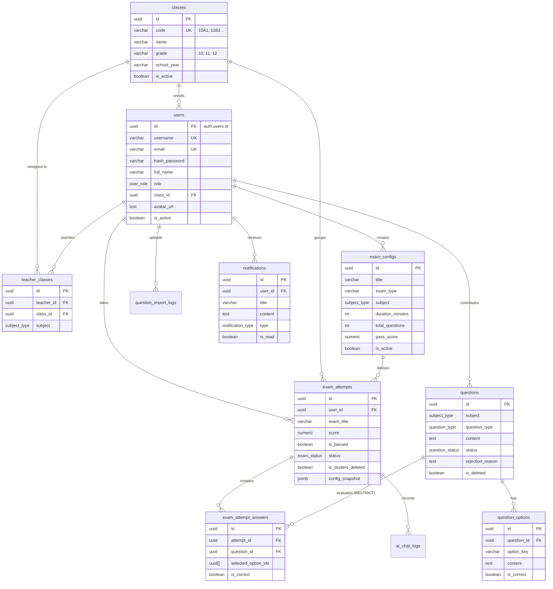

# THIẾT KẾ CƠ SỞ DỮ LIỆU SUPABASE CHO EXAM APP (SELF-HOSTED DOCKER)

> **Căn cứ tài liệu:** [Supabase Self-Hosting with Docker Guide](https://supabase.com/docs/guides/self-hosting/docker)  
> **Phiên bản:** 2.0 (Chuẩn hóa toàn diện 11 bảng, 8 bản vá bảo mật và phân quyền nâng cao)  
> **Phạm vi nghiệp vụ:** Toàn bộ 10 Flows (Đăng ký/Đăng nhập, Thi thử AI Chatbot, Thi thật tự nộp bài, Xóa mềm, Cấu hình đề thi, Phân lớp học sinh, Giáo viên quản lý lớp, Đóng góp & Phê duyệt câu hỏi, Import Excel, Dashboard & Bảng xếp hạng).

---

## 1. KIẾN TRÚC TỔNG THỂ DOCKER (SUPABASE STACK)

Theo chuẩn tài liệu chính thức mới nhất của Supabase, hệ thống được đóng gói thành một cụm Docker Compose thống nhất gồm các dịch vụ độc lập:

```
                            [ Trình duyệt / Client (Next.js) ]
                                            │
                                  Port 8000 (HTTP)
                                            ▼
                    ┌───────────────────────────────────────────────┐
                    │          API Gateway (Envoy Proxy)            │
                    └───────┬───────────┬───────────┬───────────┬───┘
                            │           │           │           │
            ┌───────────────┘           │           │           └────────────────┐
            ▼                           ▼           ▼                            ▼
┌───────────────────────┐   ┌─────────────────┐   ┌────────────────────┐   ┌───────────────────────┐
│ Supabase Studio (UI)  │   │  Auth (GoTrue)  │   │ PostgREST (REST)   │   │  Realtime (Websocket) │
│ Dashboard quản trị    │   │  Đăng nhập/JWT  │   │  CRUD tự động RLS  │   │   Phát sóng sự kiện   │
└───────────┬───────────┘   └────────┬────────┘   └─────────┬──────────┘   └───────────┬───────────┘
            │                        │                      │                          │
            └────────────────────────┼──────────────────────┼──────────────────────────┘
                                     ▼                      ▼
                            ┌───────────────────────────────────────────┐
                            │    Connection Pooler (Supavisor/Direct)   │
                            └─────────────────────┬─────────────────────┘
                                                  ▼
                                    ┌───────────────────────────┐
                                    │  PostgreSQL 17 Container  │
                                    │  (Schema, Triggers, RLS)  │
                                    └───────────────────────────┘
```

- **PostgreSQL 17 (`supabase-db`)**: Cơ sở dữ liệu hạt nhân, chứa toàn bộ schema, triggers, views, stored procedures và chính sách bảo mật hàng (Row Level Security - RLS).
- **Envoy Gateway (`api-gw`)**: Tiếp nhận toàn bộ traffic tại port `8000`, định tuyến đến Studio, REST API, Auth, Realtime và Storage.
- **GoTrue (`auth`)**: Quản lý tài khoản thí sinh, giáo viên, admin qua Email/Password và Google OAuth 1-touch.
- **PostgREST (`rest`)**: Tự động sinh RESTful API từ schema PostgreSQL với bảo vệ RLS.
- **Supabase Studio (`studio`)**: Giao diện trực quan xem bảng dữ liệu, chạy SQL Editor, quản lý người dùng và cấu hình API.

---

## 2. SƠ ĐỒ THỰC THỂ LIÊN KẾT (MERMAID ERD)



---

## 3. BẢN VÁ 8 LỖ HỔNG BẢO MẬT & QUY TẮC TOÀN VẸN DỮ LIỆU

1. **Chống tự nâng quyền:** Trigger `handle_new_user()` luôn gán `role = 'student'` cho mọi tài khoản đăng ký. Quyền `teacher` và `admin` chỉ do Admin gán nội bộ.
2. **Chống F12 / API đọc trước đáp án:** Bảng `question_options` không cho học sinh SELECT cột `is_correct`. Đề thi được cung cấp qua hàm `fn_get_exam_questions()` giấu đáp án và giải thích.
3. **Chống sửa điểm:** Trigger `trg_protect_exam_attempt_grades` chặn sửa đổi điểm số và trạng thái bài thi từ API. Điểm chỉ được tính và lưu bởi `fn_submit_exam_attempt()`.
4. **Bảo mật View:** View `profiles` cấu hình `WITH (security_invoker = true)` và loại trừ hoàn toàn cột `hash_password`.
5. **Bảo toàn bài hết giờ:** View xếp hạng và thống kê lớp tính cả `status = 'timed_out'`.
6. **Bảo toàn điểm số khi học sinh xóa mềm:** Sử dụng cờ `is_student_deleted`. Giáo viên và Admin luôn thấy đầy đủ dữ liệu điểm số thật.
7. **Bảo toàn lịch sử câu hỏi:** Áp dụng `ON DELETE RESTRICT` và lưu Snapshot nội dung câu hỏi trong bài làm.
8. **Chấm điểm chuẩn xác:** Điểm = (Số câu đúng / Tổng số câu đề thi) × 10. Bỏ trống câu bị tính 0 điểm.

---

## 4. MA TRẬN PHÂN QUYỀN VÀ ROW LEVEL SECURITY (RLS)

| Bảng | Thí sinh (Student) | Giáo viên bộ môn (Teacher) | Quản trị viên (Admin) |
| :--- | :--- | :--- | :--- |
| `classes` | Chỉ xem danh sách lớp đang hoạt động để chọn khi đăng ký. | Xem danh sách lớp. | Toàn quyền CRUD (Tạo, sửa, xóa, phân lớp). |
| `users` | Xem và sửa thông tin cá nhân của chính mình. | Xem hồ sơ học sinh thuộc các lớp mình phụ trách. | Toàn quyền xem và cập nhật phân quyền mọi user. |
| `teacher_classes` | Không có quyền truy cập. | Xem phân công giảng dạy của mình. | Toàn quyền phân công giáo viên vào lớp theo môn. |
| `exam_configs` | Xem các đề thi đang mở. | Xem cấu hình đề thi. | Toàn quyền cấu hình (số câu, thời gian, điểm đạt, loại kỳ thi). |
| `questions` | Chỉ đọc các câu hỏi đã duyệt (`approved`) trong bài thi. | Xem câu đã duyệt + câu mình đề xuất (`pending`, `rejected`). Sửa câu bị rejected để nộp lại. | Toàn quyền CRUD, phê duyệt / từ chối câu hỏi. |
| `question_options` | Không SELECT trực tiếp (tránh F12); lấy qua RPC đã giấu đáp án. | Xem đáp án của môn mình dạy. | Toàn quyền quản trị. |
| `exam_attempts` | **Chỉ xem bài của mình (`is_student_deleted = false`)**. Điểm bị khóa. | Xem toàn bộ kết quả của học sinh lớp mình dạy theo đúng môn (kể cả bài xóa mềm). | Toàn quyền xem toàn bộ hệ thống để lập báo cáo, xếp hạng. |
| `notifications` | Nhận thông báo cá nhân. | Nhận thông báo duyệt câu hỏi, bài nộp mới. | Toàn quyền quản trị. |
| `ai_chat_logs` | Xem và tạo nhật ký hỏi đáp AI của bài thi mình. | Xem nhật ký AI của học sinh lớp mình. | Toàn quyền quản trị. |
